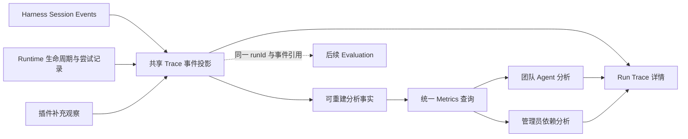

# Agent Observability Implementation Plan

**Goal:** 将单次 Run 的 Trace 升级为 Agent 运行分析系统，让团队定位运行表现变化，让管理员识别影响多个 Agent 的共享 Tool 和 Model 问题。

**Architecture:** Harness Session、Runtime 生命周期及工具尝试记录继续作为执行事实来源；扩展现有 Trace 事件契约，再生成可重建的分析投影。Observability 负责查询、聚合与归因证据，Runtime 负责执行与可靠性，Evaluation 负责业务质量判定；保留 Harness 唯一 Agent Loop。

**Tech Stack:** 当前仓库已有 TypeScript、Cordis hooks、Storage Domain、Zod、Typert Remote、平台 HTTP API、React、Vitest 和 Web E2E。

**状态：** 2026-09-17 已完成当前单 Host 版本，含模型估算成本。实施基于工作区现有 Reliable Runtime、Shared Resources 和 Workspace Governance 改动，未提交 Git。验收与实际边界见 [验收记录](../observability-acceptance.md)。下文保留原计划；实际采用每个 Run 单条原子分析记录、两个统一查询接口和启动时幂等重扫，未引入多表 generation 或持久化回填游标。

## 1. 产品范围与架构责任

本次要解决的核心问题是：已有 Run 详情可以解释单次执行，但团队无法方便地比较版本运行表现，管理员也无法判断共享依赖的影响面。

| 实施前必须明确的问题 | 本计划的回答 |
|---|---|
| 产品问题 | 从逐条查日志，升级为发现 Agent、Tool、Model 的稳定性、延迟、Token 和成本变化 |
| 所属层 | Observability 管分析；Runtime 提供真实生命周期、尝试与人工恢复事实；Control Plane 提供归属与权限 |
| Harness 已提供什么 | Session 事件、模型 usage、工具结果、模型流通知和工具执行 hooks |
| 是否能通过插件实现 | 可以。扩展现有 agent-builder 内的 Trace/Runtime adapter 和独立分析存储，不修改 Agent Loop |
| 最小实现 | 一个 Host、现有存储、结构化事件、跨 Run 指标、两个角色视图、Trace 下钻；无需独立监控服务 |

第一版覆盖：Task success rate、Tool success rate、Latency、Token、Error、Retry、现有 Runtime 人工恢复事件；后续增量补齐 Model estimated cost。运行表现下降可以发现和定位，答案正确率下降只能在接入 Evaluation 后确认。

不在本次范围：通用 APM、分布式 Trace、跨 Host 采集、Kafka/ClickHouse/Prometheus 集群、任意日志搜索、告警平台、新的人审工作流、自动执行优化、自动判定业务答案质量。Memory 指标沿用未来相同事件契约扩展，不为当前五项指标建设额外子系统。

## 2. 当前代码事实与缺口

以下源码路径均相对于 `D:/developer/Platform/deepseek-harness-master/`。

| 已有位置 | 已确认能力 | 本次改动 |
|---|---|---|
| `packages/business/agent-builder/src/trace-types.ts`、`trace-schema.ts` | 已有模型/工具 start、completed、failed，模型重试、工具重试、Run 生命周期；事件有 operationId、usage、error、incomplete | 扩展分析所需关联、尝试、错误分类、人工介入、usage 分项；兼容旧记录 |
| `packages/business/agent-builder/src/trace-projection.ts` | 统一投影 Session、模型起点、Run 事件与 Runtime 工具历史 | 补齐逻辑调用与 attempt 配对、结构化错误、介入事件，继续作为共享投影入口 |
| `packages/business/agent-builder/src/platform-traces.ts` | `platform_run_traces` 保存模型起点、版本化事件页和摘要；确定性 revision，页先写再发布摘要 | 暴露已发布投影的内部只读消费入口，增加对账通知；分析不依赖用户打开 Run 详情 |
| `packages/business/agent-builder/src/runtime-tools.ts` | durable invocation 和 history，含 attempt、开始/结束及 outcome | history 当前缺少逐次错误码；在原记录补齐错误、结果来源，不增加另一套工具日志 |
| `packages/business/agent-builder/src/platform-runs.ts`、`run-lifecycle.ts`、`run-schema.ts` | 同一 Run 下恢复、重试、BLOCKED、人工 resolve 和终态；区分 execution/detected 完成时间 | 补持久化介入关联与终态原因引用；Runtime 继续决定状态 |
| `packages/business/agent-builder/src/version-schema.ts`、`resource-types.ts` | AgentVersion 固定配置与 ResourceManifest | 用运行绑定版本关联资源 ID/版本，不能用当前草稿替换历史归属 |
| `packages/business/agent-builder/src/governance.ts`、`platform-api.ts` | workspace 的 admin/developer/user；Trace 为 edit 权限；无全局超级管理员 | 分析接口继承服务端权限；ownerTeam 只作分析维度，不能作为现成团队 ACL |
| `packages/client/ui-agent-preset/src/client/AgentRegistry.tsx`、`RunDetails.tsx`、`RunTrace.tsx` | Agent、版本、Run 和单次时间线页面 | 新增 Analytics 页签、Workspace 总览和下钻，保留原有 Trace |
| `packages/business/agent-builder/src/platform-page.ts` | 独立平台页面入口 | 与 React 入口使用相同分析 API 和口径，覆盖治理后的实际使用入口 |

当前 Trace 已经结构化，本次不是从文本日志中重新抽取事实。重点是把现有事件变成可信的跨 Run 数据集。

## 3. 推荐方案与替代方案

| 方案 | 收益与代价 | 选择 |
|---|---|---|
| 结构化 Trace → 按 Run/调用保存分析事实 → 查询聚合 | 保持同源，可重建、可下钻，适合当前单 Host；需要一个小型投影服务 | 推荐 |
| 每次打开大盘扫描全部 Session JSONL | 起步代码少，但查询开销随历史和日志体积增长，容易出现不同页面口径不一致 | 仅作为显式重建路径 |
| 接入完整第三方 APM/独立分析数据库 | 适合后续高吞吐与跨服务需求；当前增加运维、权限和同步成本 | 暂不引入 |



首版分析模块放在现有 `agent-builder` 包中，类、类型和 Storage Domain 单独划分，不为了这一功能迁出整个包。只有现有 hooks 确认无法提供必需事实时，另行说明核心改动原因；本计划预计无需修改 Harness core。

## 4. 统一事件契约

### 4.1 身份、关联与版本

扩展现有 Trace 契约，事件页仍复用 RunTrace 的公共归属；内部分析消费者获得包含归属的 event envelope，无需在每条持久化事件中复制所有 Run 字段。

| 字段组 | 必要字段与规则 |
|---|---|
| 来源 | `schemaVersion`、`eventId`、`occurredAt`、`sourceSeq/sourceRunEventId`，补可引用 Runtime invocation/attempt 的 sourceRef |
| Run 归属 | `workspaceId`、`agentId`、`agentVersionId`、`runId`、`sessionId`、`deploymentRevision`、`configHash` |
| 组织归属 | 新 Run 捕获 `ownerTeamIdAtStart`；旧 Run 缺失时保留 unknown，不回填为当前 Owner |
| 调用身份 | `operationId` 表示一次逻辑调用，`attemptId` 表示真实尝试，`attemptNumber`、可选 `parentOperationId` |
| 实际依赖 | `provider/model`、`toolName`、可选 `resourceId/resourceVersionId`；实际调用路由优先于配置默认值 |
| 测量 | `durationMs`、完整 usage 分项、结构化 error、incomplete、resultSource |
| 完整性 | 字段级 unknown/partial，运行级缺失原因与采集覆盖范围；缺失不转成 0 |

现有 eventId 保持稳定。新 attemptId 由持久化调用身份和尝试序号产生，不使用当前时间或随机 ID 重新生成。一个逻辑工具调用重试三次，仍是一个 operation、三个 attempt；Run 恢复也不创建新的逻辑 Task 样本。

工具 attempt 优先以 Runtime invocation history 的真实 dispatch 边界为准；Session 的 tool/call 与 tool/result 作为同一次调用的补充来源，不能和 history 再各计一次。重试后的最终 tool/result 不能覆盖第一次 attempt 的失败。参数校验或权限拒绝发生在 dispatch 之前时，保留调用拒绝事实，但不混入已经执行的工具 attempts；单列拒绝数量和原因。

对于没有 Runtime history 的历史工具调用，只在已有事件足以确认尝试时生成 legacy attempt，并明确来源覆盖；工具逻辑调用总耗时可能含重试与等待，不能用它替代单次 attempt 延迟。

模型重试按同一 turn/step 下有来源支持的重试链关联。无法可靠判断属于哪条链时不强行合并，保留 attempt 级统计与关联缺失标记。

资源关联优先使用执行时绑定与不可变 ResourceManifest。名称相同但资源 ID 不同的工具必须分开；旧数据按实际工具名或 provider/model 归入 legacy 分组，不猜资源版本。

### 4.2 事件种类

| 类别 | 事件/事实 | 处理规则 |
|---|---|---|
| Task | 已有 `run.*` | Runtime 终态是唯一运行结果来源 |
| LLM | 已有 `model.call.started/completed/failed/cancelled` | 每次真实 attempt 有独立身份与 usage |
| Tool | 已有 `tool.call.*`、`tool.retry.*` | 保留公共事件兼容性，统一映射为逻辑调用和真实尝试 |
| Error | 失败事件携带统一 `error` | 失败事件本身就是错误事实；不再额外生成一条重复计数的独立 Error |
| Retry | 已有模型/Run retry scheduled、工具 retry started | 调度重试与实际执行分开；scheduled 后取消不能算已执行一次 |
| Human Intervention | 拟增 `human.intervention.requested/resolved` | 从现有 BLOCKED/resolve 事实投影，记录 interventionId、原因、操作人、decision 和等待时长 |

人工介入必须持久化每一次 requested/resolved 关联，不能仅读取 `runtime.resolution` 的最后一次值。操作人由服务端 principal 取得；取消等待中的 Run 应结束等待统计，但不伪造 resolved。旧 `run.blocked/run.resolved` 缺少 actor 或关联时显示缺失。

此阶段只记录现有 Runtime 人工恢复流程；不把所有 `BLOCKED` 状态解释成已经发生人工操作，也不新增审批产品。

### 4.3 错误分类和归因

统一结构示意：

```ts
type ErrorCategory =
  | 'tool_timeout' | 'tool_error' | 'model_timeout' | 'model_error'
  | 'invalid_params' | 'rate_limited' | 'permission_denied'
  | 'runtime_error' | 'unknown'

interface AnalysisError {
  code: string
  category: ErrorCategory
  origin: 'tool' | 'model' | 'runtime'
  retryable: boolean | null
  causeEventId: string | null
  classifierVersion: number
}
```

先使用 adapter/Runtime 的明确 code 和 origin 分类，再使用有测试的已知映射。不要用错误消息字符串包含“timeout”作为唯一证据。无法归类进入 unknown，保留脱敏后的原 code。

区分两个问题：

1. **调用失败分布**：每个失败 attempt 一个样本，包括最终恢复成功的调用。
2. **任务失败原因分布**：每个 FAILED Run 一个样本，依赖显式终态 cause 引用；没有因果证据的归入 unknown/runtime，不把“最后一个失败工具”自动判为任务根因。

Tool timeout、model_error 等分类按规则互斥，分母包含 unknown。图表同时显示次数和百分比；模型错误与工具超时可能属于同一条执行链，但不会在任务失败饼图中重复占位。

## 5. Metrics 口径

### 5.1 窗口与样本

默认展示过去 7 天，支持 24 小时、30 天、自定义窗口，以及最近 100/1000 次已终结 Run。时间窗口采用 UTC 半开区间 `[from, to)`，界面按用户时区显示，固定快照 `asOf`。

- Run 聚合按 `finishedAt` 落桶，最近 N 次按 `finishedAt + runId` 稳定排序，先限定授权范围与筛选条件再截取。
- 独立 Tool/Model 资源页按 attempt 的结束时间落桶。Agent 详情中的调用指标则统计所选 Run 样本内的调用，页面注明 cohort。
- 两类筛选用明确 `cohortMode` 区分，下钻携带相同模式和快照，避免页面数字无法对账。
- 在途状态单独提供当前 PENDING/RUNNING/RETRY_WAIT/RECOVERING/BLOCKED 数量和最长等待，不混入已结束 Run 的成功率。
- 检测时间仅用于“发现中断”展示；没有可信执行结束时间的 Run 单列时间未知样本，不能伪装成窗口内精确执行耗时。

### 5.2 具体计算

| 指标 | 首版口径 | 展示约束 |
|---|---|---|
| Task success rate | `SUCCEEDED / (SUCCEEDED + FAILED)` | CANCELLED、未完成、时间未知分别列数量；页面明确这是运行成功率 |
| 取消率 | `CANCELLED / (SUCCEEDED + FAILED + CANCELLED)` | 不藏起取消样本；零分母显示 `—` |
| Tool attempt success rate | 成功 attempts / 已知成功或失败 attempts | 包含重试，unknown/取消/未结束另列；作为工具稳定性的主指标 |
| Tool logical success rate | 最终成功 operations / 已知最终成功或失败 operations | 辅助显示重试后的成功率，不能与 attempt 指标混称 |
| Tool timeout rate | 明确 timeout attempts / 已知成功或失败 attempts | 同时显示“超时占失败”的比例时单独标注分母 |
| Latency | Run 墙钟耗时和模型/工具 attempt 耗时各自 AVG/P50/P95 | 不相加并行工具耗时；仅用真实边界；P95 采用 nearest-rank，附 sampleCount |
| Waiting | 排队等待、重试等待、人工等待分别按有配对的区间计算 | 端到端 Run 耗时含内部等待；缺边界时不靠相减推造 active time |
| Token | provider usage 的输入/输出/总量与每 Run 均值 | 重试实际消耗计入；reasoning 不重复相加，cache 分项保留 |
| Retry | 有实际重复尝试的 Run 比例、额外 attempt 次数、重试后成功率 | 按 model/tool/runtime 分类；scheduled 但未执行不计额外调用 |
| Human intervention | 出现 requested 的 Run 比例、resolved 次数、等待时长和当前等待量 | 一次 Run 多次介入按 interventionId 去重，不能拿 resolved 事件数当 Run 数 |
| Error | attempt 错误分布、FAILED Run 原因分布、受影响 Agent/Run 数 | 原因与影响分开，所有统计能下钻 |

Task success rate 可以完全来自 Runtime，不因 Trace 缺失而删除失败样本。Token/Latency/Tool 指标各自返回 validCount、unknownCount 与 coverage，不能用一项整体 complete 标志掩盖局部缺失。

平均 Token 默认使用 usage 完整的 Run：`这些 Run 的总 Token / 这些 Run 的数量`，旁边显示覆盖 `920/1000`。部分 usage 的已知 Token 可作为“已记录总量”展示，不能按 1000 个 Run 求所谓精确均值。明确无模型调用且事实完整的 Run 可以计 0，缺失模型记录不能推断为 0。

AVG 用总量/总样本数，比例用总分子/总分母，不能平均每天的平均值或百分比。P95 从匹配的原始时长样本计算，不能平均日 P95。

## 6. 分析投影、可靠性与历史升级

新增 `platform_observability` Storage Domain，首版只保存查询所需的紧凑事实：

- `runFacts`：Run 归属、版本、状态、真实时间、失败原因引用、Token 覆盖与介入摘要。
- `operationFacts`：逻辑调用关联、资源身份、最终 outcome。
- `attemptFacts`：attempt 身份、时间、outcome、错误分类、usage 分项和事件引用。
- `projectionHeads`：每个 Run 已发布的来源指纹、分析 schema 版本与 generation。
- `rebuildState`：可恢复的后台扫描进度与失败项；全量任务不在用户查询链路执行。

这些表是可重建读模型，不是第二个执行记录系统。不复制 prompt、工具参数、完整返回值和模型正文，只保留必要分类与原始 Trace 引用。

### 6.1 更新与一致性

1. Trace 成功发布新 revision 或 Runtime 归属/终态变化后，按 Run 合并通知，后台读取来源的一致快照。
2. 纯投影函数从快照重算该 Run 的紧凑事实；身份基于原始 event/operation/attempt，不根据通知次数累加。
3. 写入新 generation 的所有事实，最后发布 `projectionHeads`；查询只读 head 指向的完整 generation，不假定多表事务。
4. 查询快照完成前保留旧 generation；用有界读取租约或服务内串行快照保护，不能发布后立即删除仍在使用的事实。
5. source fingerprint 相同直接跳过。任务失败先到、Trace 后到时，先保留 Runtime 统计，后补调用数据，替换同一 Run 的投影。
6. 汇总缓存绑定过滤器、授权范围和 generation，角色变化时重新鉴权；不能缓存一份管理员结果给普通用户复用。

关闭顺序延续现有生命周期：Runtime 停止并完成收尾，Trace drain，Observability drain，最后关闭其存储。指标写入失败只影响分析可用性，不决定 Run 成败。

### 6.2 初始回填与恢复

当前 Trace 存在历史懒重建路径，因此不能仅汇总已经被用户查看过的 Run。首启分页遍历 Runtime 的全部可用 Run，按需重建 Trace 并建立分析事实；后台限并发并持久化游标。重启还要检查来源指纹落后的终态 Run，不能只看 pending。

数据迁移扩展 schema 时，对旧事件和工具 history 提供兼容默认值，不能令旧 Storage Domain 因新增必填字段打不开。历史缺少 attempt 错误、usage cache 分项、人工 actor、Owner 快照时标为 unknown，不伪造。

公开 `asOf`、`dataState`、`indexedRunCount`、`eligibleRunCount`、`lagMs`、`missingReasons`。回填未结束时显示覆盖与进度，不把局部数据宣传为完整平台结果。generation 垃圾回收只能删除已确认不被引用的分析副本，不清理源日志。

### 6.3 性能边界

首版在查询时聚合紧凑事实，维护 workspace/时间/agent/version/resource 索引，禁止每次大盘请求重扫所有 Session。默认最多查询 30 天，结果榜单分页，上限由接口校验；更长历史以显式窗口分段。

验收目标：固定无密钥 fixture 的 10,000 个 Run、100,000 个 attempts，记录测试机器与查询耗时；预热后核心聚合 P95 小于 1 秒、正常负载下新增事实 5 秒内可见，作为待验证目标而非现有能力声明。

如果实测不达标，再增加小时/日预聚合；必须保留精确分子分母、Run 去重和可重建能力。不同桶的 distinct Agent 不能直接求和；分位数需要保留样本或引入明确误差的合并 sketch。容量超过单 Host 的可接受范围时再讨论数据库，不先建设。

## 7. Model 成本分析（第三阶段）

当前 TraceUsage 主要保留输入/输出/总 Token，不足以精确套用缓存差异费率。先保留实际 `uncachedInputTokens/cacheReadTokens/cacheWriteTokens/outputTokens`、provider/model 与 usage 来源，再做成本。

首版由管理员配置版本化 Model 价格表：provider/model、计价币种、每百万 Token 各分项单价、effectiveFrom/effectiveTo 和 priceVersion。此计划不写入任何供应商实时价格，不通过自动抓取价目表建立隐含依赖。

```text
estimatedCost =
  uncachedInputTokens × inputRate
  + cacheReadTokens × cacheReadRate
  + cacheWriteTokens × cacheWriteRate
  + outputTokens × outputRate
```

统一按每百万 Token 换算，使用十进制定点金额或明确的整数微单位；仅最后展示时舍入。reasoning 为输出子集，不再次收费。每次 attempt 按真实开始时刻匹配价格版本，包括失败与重试中已知的 usage。

缺少价格、usage 或必要分项时显示 unknown/partial 和可计算覆盖率，不能默认免费。不同币种不直接相加；首版可配置统一币种，仍需在 schema 和响应中显式返回币种。

保存应用的 priceVersion 和计算规则版本，重建不自动把历史费用改成今天的价格；更正历史价格必须作为显式重算操作，响应反映新版本。界面使用“估算成本”，不当作供应商账单。

Model 榜单分别显示总估算成本、每次调用均值、每 Run 成本、Token、失败率和覆盖率。总成本高可能只是调用量大，不能据此直接推荐换模型。

## 8. 页面与分析流程

### 8.1 团队：Agent → Analytics

筛选：时间范围/最近 N 次、AgentVersion、部署 revision；团队归属可作为筛选维度。页面包括：

1. Run 数量、运行成功率、取消和未完成数量、AVG/P95 延迟、平均 Token、重试和人工介入比例。
2. 按时间的成功率/延迟/Token 趋势，错误分类与 Tool 失败排行。
3. 两个已运行版本对比，显示样本量、完整性和同一指标的差值。
4. 点击指标或异常分组进入匹配 Run 列表，再打开已有 Trace 的相关 event。

版本对比固定相同权限范围、指标口径和明确的采样窗口。成功率变化使用百分点，延迟/Token 可用百分比且处理基线为 0；少于 30 个完整样本时标“样本较少”，不宣称统计显著。

表述示例：`v3 的 P95 由 18s 增至 31s；search 工具超时比例同步升高，涉及 23 个 Run`。这是观察到的关联；只有事件因果链明确时才称为失败原因。生产输入和流量变化可能影响版本比较；要判断业务质量回归，后续通过同一数据集、同一 evaluator 版本关联 Evaluation 结果。

### 8.2 管理员：Workspace → Observability

- **Agent 排行**：成功率、失败次数、样本量、P95、Token；支持按失败次数和失败率分别排序。
- **Tool 健康**：资源 ID/版本、尝试成功率、超时率、重试次数、P95、受影响 Agent/Run 数。
- **Model 使用**：实际 provider/model 的调用、Token、错误、延迟与估算成本。
- **失败分析**：明确区分调用错误和任务失败原因，包含 unknown，支持下钻。

影响面定义：窗口内发生失败 attempt 的去重 Agent/Run 数；另外可显示资源使用者总数，但“声明依赖”不能当成“实际受影响”。

示意验收数据，非当前平台实测：

| SRE Agent 最近 1000 次已终结运行 | 示例 |
|---|---|
| 成功 / 失败 / 取消 | 920 / 80 / 0 |
| 运行成功率 | 92% |
| 平均耗时 | 15s，附有效时长样本数 |
| 失败原因 | Tool timeout 32（40%）；Model error 24（30%）；invalid params 16（20%）；unknown 8（10%） |
| 平均 Token | 5000，附 usage 完整覆盖数 |

### 8.3 权限边界

Agent 分析沿用 Trace 的 edit 能力（developer/admin），普通 user 保持既有访问能力，不因添加聚合接口获得详细分析数据。Workspace 全体 Agent/依赖榜单要求 admin；每次查询、分页和 Trace 下钻服务端重新验证权限。

当前只有 workspace admin，没有可读全部 workspace 的全局平台管理员。首版“平台总览”明确为当前授权 Workspace 内所有 Agent；这是完整平台总览的阶段性范围限制。真正跨 workspace 总览需要后续 Control Plane 增加显式全局只读分析权限，不能用 ownerTeam 或前端隐藏菜单替代。

## 9. 查询接口草案

所有名称为拟新增，实施时按现有 Typert/HTTP 命名方式生成公开契约：

| 接口 | 用途 |
|---|---|
| `observabilityAgentSummary(workspaceId, agentId, query)` | Agent 卡片与趋势 |
| `observabilityVersionCompare(workspaceId, agentId, query)` | 两个指定版本的统一口径对比 |
| `observabilityWorkspaceOverview(workspaceId, query)` | 管理员 Agent 排行和整体概况 |
| `observabilityToolStats(workspaceId, query)` | 工具成功率、超时、影响面 |
| `observabilityModelStats(workspaceId, query)` | 模型 Token、延迟、错误、估算成本 |
| `observabilityRuns(workspaceId, query, cursor)` | 保持相同样本和过滤条件的下钻 Run 列表 |

`query` 使用判别联合：time window 或 lastRuns，不能同时传；另含 version、resource、errorCategory、cohortMode。第一版默认 50 条、最大 100 条。响应包含 sampleCount、有效/未知计数、coverage、asOf、数据修订号和数据状态。

游标绑定 workspace、全部筛选条件、权限范围和结果修订；不能复用其他 workspace 游标。初版允许查询修订变化后明确返回 stale 并刷新整页，不允许静默将两个快照拼成一个列表。错误的 AgentVersion/资源归属、未知过滤字段和过大查询范围在服务端拒绝。

接口同时接入 `index.ts`、`platform-api.ts` 显式 allowlist 和现有客户端 transport；不要只完成 trusted Host 的 Remote 接口却遗漏独立平台入口。

## 10. 实施阶段与任务

### O1：统一事实与核心指标

**Task 1：事件身份、错误与 usage 契约**

- 修改：`packages/business/agent-builder/src/trace-types.ts`、`trace-schema.ts`、`trace-projection.ts`、`types.ts`。
- 新增：`packages/business/agent-builder/src/observability-types.ts`、`observability-errors.ts`。
- 测试：扩展 `packages/business/agent-builder/tests/trace-projection.spec.ts`；新增 `observability-errors.spec.ts`。
- 步骤：先增加 attempt 去重、缓存 usage、未知分类、旧事件读取用例并确认失败；实现兼容字段和纯分类；运行同组测试确认通过。
- 完成条件：同一失败不会因 Error/Retry/终态三种展示重复计数，旧 Trace 仍可读取。

**Task 2：补齐真实尝试和人工介入来源**

- 修改：`packages/business/agent-builder/src/runtime-tools.ts`、`platform-runs.ts`、`run-schema.ts`、`run-lifecycle.ts`，必要时在 `index.ts`/`platform-api.ts` 传递已认证 actor。
- 测试：扩展 `packages/business/agent-builder/tests/runtime-recovery.spec.ts`、`principal-context.spec.ts`。
- 步骤：先测失败后重试成功、超时错误保留、多次人工介入、resolve 请求重放、旧 history 无错误字段；再补原 durable 记录；验证 Runtime 的重试/恢复行为不变。
- 完成条件：一个工具调用经历三次尝试时，逻辑调用为 1、attempt 为 3；人工确认完成不伪造成一次真实成功工具执行。

**Task 3：纯分析投影与指标计算**

- 新增：`packages/business/agent-builder/src/observability-projection.ts`、`observability-metrics.ts`。
- 新增测试：`packages/business/agent-builder/tests/observability-projection.spec.ts`、`observability-metrics.spec.ts`。
- 步骤：先写固定事件与 Run fixture，锁定本文第 5 节口径；实现纯投影；覆盖窗口边界、取消、零分母、未知结束时间、Token coverage、并行工具和 P95；确认手工计算一致。
- 完成条件：Runtime 失败但 Trace 缺失仍计入任务失败，其他不完整指标独立展示覆盖率。

**Task 4：持久化、回填与重建**

- 新增：`packages/business/agent-builder/src/observability-schema.ts`、`platform-observability.ts`。
- 修改：`packages/business/agent-builder/src/platform-traces.ts`、`platform-runs.ts`、`index.ts`，只添加必要的内部读接口/通知与装配。
- 新增测试：`packages/business/agent-builder/tests/observability-store.spec.ts`；扩展 `packages/bundle/business-agents/tests/composition.spec.ts`。
- 步骤：先测重复通知、generation 半写、迟到 usage、通知丢失、终态回填、重启断点；实现 shadow generation 发布与限流后台对账；验证普通读取不遍历原 Session。
- 完成条件：同一来源重放十次与一次结果一致；故障后可重建；Trace/指标写入故障不改写 Run 结果。

### O2：分析 API、两个角色视图与版本对比

**Task 5：查询与权限**

- 修改：`packages/business/agent-builder/src/index.ts`、`platform-api.ts`、`platform-http.ts`（仅必要的路由变化）。
- 新增：`packages/business/agent-builder/tests/observability-api.spec.ts`；扩展 `workspace-isolation.spec.ts`、`governance.spec.ts`。
- 步骤：先测时间窗/最近 N 次、同 cohort 下钻、分页与 stale revision、跨 workspace 拒绝、member 撤销即时生效；实现查询 schema/服务端鉴权与公开接口；更新生成契约。
- 完成条件：卡片数值和下钻列表同源，admin 结果不能通过缓存或游标泄露给其他角色。

**Task 6：页面和交互**

- 新增：`packages/client/ui-agent-preset/src/client/AgentAnalytics.tsx`、`WorkspaceObservability.tsx`。
- 修改：`packages/client/ui-agent-preset/src/client/AgentRegistry.tsx`、`AgentVersions.tsx`、`registry-client.ts`、`registry-locales.ts`、`AgentRegistry.module.css`；按现有平台页面模式修改 `packages/business/agent-builder/src/platform-page.ts`。
- 新增测试：`packages/client/ui-agent-preset/tests/observability.client.spec.tsx`。
- 步骤：先覆盖空数据、低样本、缺 usage、回填中、部分故障、版本对比、筛选及下钻；实现中文/英文指标说明和两个角色入口；复用 RunDetails/RunTrace。
- 完成条件：团队可以定位某版本的 Tool timeout 样本；管理员可从 Tool 排行进入受影响 Agent 和具体 Trace。

### O3：模型估算成本与完整验收

**Task 7：价格规则和 Model 成本**

- 新增：`packages/business/agent-builder/src/observability-pricing.ts` 与 `tests/observability-pricing.spec.ts`。
- 修改：`observability-types.ts`、`observability-schema.ts`、`observability-projection.ts`、`index.ts` 配置/接口以及上述 Model 视图；价格可先由 Host 管理配置提供，无需建设复杂价格管理台。
- 步骤：先测缓存分项、失败 attempt usage、未知价格、多币种、价格版本切换和重建稳定性；实现版本化定点计算；接入成本排行与覆盖说明。
- 完成条件：可回答“哪个 Model 已知估算总成本最高”，同时展示单位成本和数据覆盖，不能把缺价模型当作免费模型。

**Task 8：端到端、容量与文档**

- 新增：`apps/web/tests/agent-observability.e2e.ts`、`packages/business/agent-builder/tests/observability-performance.spec.ts`。
- 新增验收记录：`D:/developer/Platform/docs/observability-acceptance.md`。
- 修改受影响包 README、API/配置/持久化目录、双语资料和 Agent Note；修改前读取对应目录 AGENTS.md。
- 步骤：无密钥 fixture 生成两个版本、多个 Agent 共用一个 Tool、模型重试及人工介入；验证聚合与下钻；重启 Host 验证数值不变；测量目标容量并记录结果；运行定向回归与构建。
- 完成条件：O1/O2/O3 的事实、页面、成本和历史兼容都有实测证据；未达成项明确列出，不以计划目标代替结果。

O1 → O2 → O3 顺序交付。O2 完成后已可用于分析 Agent 运行表现；O3 完成才包含本次提出的“哪个 Model 成本最高”。Evaluation 质量结果接入是后续独立功能，不作为本计划已交付内容。

## 11. 测试命令与关键验收

以下命令在 `D:/developer/Platform/deepseek-harness-master/` 执行；新增测试文件完成后才运行对应命令。本次计划阶段未执行这些测试。

```powershell
pnpm exec vitest run packages/business/agent-builder/tests/observability-errors.spec.ts packages/business/agent-builder/tests/observability-projection.spec.ts packages/business/agent-builder/tests/observability-metrics.spec.ts packages/business/agent-builder/tests/observability-pricing.spec.ts
pnpm exec vitest run packages/business/agent-builder/tests/observability-store.spec.ts packages/business/agent-builder/tests/observability-api.spec.ts packages/business/agent-builder/tests/trace-projection.spec.ts packages/business/agent-builder/tests/runtime-recovery.spec.ts packages/business/agent-builder/tests/workspace-isolation.spec.ts packages/business/agent-builder/tests/governance.spec.ts packages/business/agent-builder/tests/principal-context.spec.ts packages/bundle/business-agents/tests/composition.spec.ts
pnpm exec vitest run packages/client/ui-agent-preset/tests/observability.client.spec.tsx packages/client/ui-agent-preset/tests/trace.client.spec.tsx packages/client/ui-agent-preset/tests/runs.client.spec.tsx
pnpm exec vitest run packages/business/agent-builder/tests/observability-performance.spec.ts
pnpm run build
pnpm exec vitest run --config vitest.web.config.ts apps/web/tests/agent-observability.e2e.ts apps/web/tests/agent-run.e2e.ts apps/web/tests/workspace-governance.e2e.ts
pnpm run verify-client-ui-i18n
pnpm run verify-cordis-api
pnpm run verify-config-catalog
pnpm run verify-persistence-catalog
```

预期：定向测试通过，构建成功，生成目录与源码一致；容量测试以记录的环境和阈值判断。新增功能实施时先写关键失败用例，再运行确认预期失败，完成最小实现后重跑相关组。当前任务只列计划，不预先声称测试通过。

| 验收场景 | 预期 |
|---|---|
| 920 成功、80 失败、20 取消 | Task success rate 92%；已终结总数 1020；取消另列，不隐藏 |
| 一次 Tool 超时后重试成功，Run 成功 | Task 100%；Tool attempt success 50%；logical success 100%；timeout 50% |
| Retry 已 scheduled，但开始前取消 | 额外实际 attempt 为 0 |
| 同一失败既有 call.failed 又有 retry 原因 | attempt 错误计 1 次；成功 Run 不进入任务失败分布 |
| 两个 Agent 使用同一个失败 Tool | 影响 Agent 数去重为 2，可分别下钻 |
| 名称相同但资源 ID 不同 | 两条资源统计，不错误合并 |
| 一个 Run 使用两个模型路由 | 各自计入真实模型使用量与费用 |
| 部分调用缺 usage，或某模型没有价格 | 总量/均值显示覆盖和 unknown；不得补 0 |
| PENDING/BLOCKED 长时间未完成 | 单独出现在当前在途/等待量，不让已结束成功率掩盖积压 |
| 人工确认工具已经完成 | 记录人工解决，不伪造真实调用耗时和成功 attempt |
| 重启、重复事件、通知丢失、半写、迟到 usage | 可对账重建，指标不重复，旧 generation 不混读 |
| 用户从未点开历史 Trace | 后台回填仍纳入历史样本，进度与覆盖可见 |
| 查询跨权限范围或成员被撤销 | 查询/游标/缓存/下钻均拒绝越权 |
| 新版本成功率不变但 P95 与 Token 增长 | 版本对比显示变化和相关样本，不直接声称答案质量下降 |

最终完成标准：管理员可从概览发现异常共享依赖，开发团队可比较版本运行表现并定位对应事件；所有核心数字有明确定义、样本量和数据覆盖，相关测试通过，现有 Harness 执行与 Runtime 行为保持兼容。
