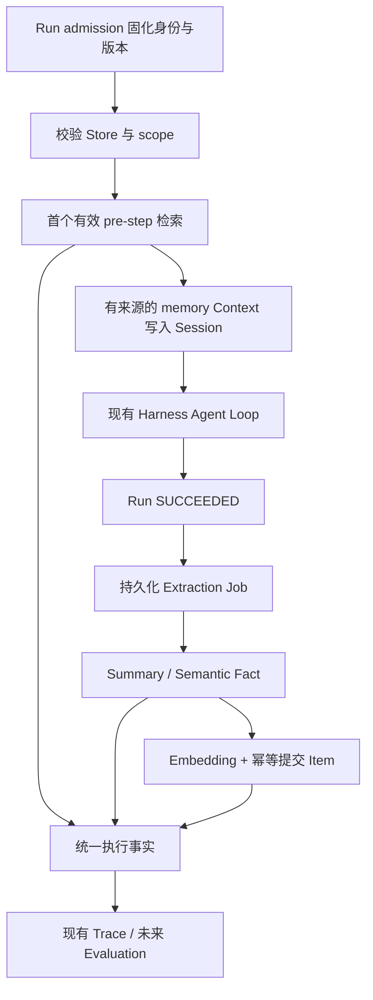

# Memory Platform Implementation Plan

> **For Claude:** REQUIRED SUB-SKILL: Use superpowers:executing-plans to implement this plan task-by-task.

**Goal:** 将现有 Workspace MemoryStore 和键值访问升级成可跨 Run 使用、可在 Agent 间共享、具有 scope 隔离与来源追踪的 Memory Platform。

**Architecture:** MemoryStore 控制面复用 SharedResources，Agent Version 固定绑定与策略，Memory Service 管理动态条目、权限、检索和写回。Runtime 通过 Harness 的 `agent/pre-step` 和既有 Run 生命周期接入；Harness 保持唯一 Agent Loop，Trace 复用执行事实投影。

**Tech Stack:** TypeScript、Cordis、Storage Domain、现有 JSON 持久化配置、Zod、Typert Remote、React、Vitest；第一版一个本地向量检索 provider，配合显式配置的 embedding adapter。暂不迁移整个 Platform 到 PostgreSQL。

**状态：** 2026-09-17，实施中。已完成 scope namespace、Agent Version binding、业务 conversation、Memory Item 持久化、local-vector 检索、Harness Context 注入及持久 writeback Job。真实 embedding/extractor provider、Trace、治理 API/UI、兼容迁移和端到端演示尚未完成。上述执行技能名称来自计划模板，执行时使用环境中实际可用的 `executing-plans` 技能。

| 阶段 | 状态 | 已完成内容 | 未完成内容 |
|---|---|---|---|
| Task 1：领域 schema 与 namespace | ✅ 完成 | `session/user/agent` namespace、可信 MemoryContext、隔离测试 | — |
| Task 2：控制面和 Agent Version | ✅ 完成 | scoped Memory binding、Version 3 renderer/schema、旧 `memoryStores` 兼容 | 管理界面编辑 binding 属于 Task 8 |
| Task 3：Run 身份和业务 Session | ✅ 完成 | Conversation 持久化、认证用户/Workspace 验证、Run MemoryContext | UI 传递 conversationId 属于后续界面工作 |
| Task 4：Item 存储与治理 API | 🟡 部分完成 | Memory Item、来源、TTL、tombstone、幂等写入、生命周期装配 | 受治理的 Item CRUD API 与管理界面 |
| Task 5：语义检索与 embedding | 🟡 部分完成 | local cosine provider、模型/维度/namespace 校验、测试 embedding seam | 真实 embedding provider 与 e2e 验证 |
| Task 6：Harness Context 接入 | 🟡 部分完成 | 首个 pre-step 注入、Session 持久来源、预算与直接用户 query | 真实 embedding 服务部署与录制 snapshot |
| Task 7：Extraction 与可恢复写回 | 🟡 部分完成 | 候选持久化、幂等 Item/embedding 写入、失败重试、成功 Run 调度/重启补建 | 真实 extractor、退避调度与写回状态 API |
| Task 8：Trace 和治理界面 | ⬜ 未开始 | — | Memory Trace 事件、API、React 页面与本地化 |
| Task 9：兼容迁移、演示与交付文档 | ⬜ 未开始 | — | legacy 导入、Web 场景、验收文档、Agent Note |

## 1. 交付目标与架构归属

产品问题：同一用户在新 Run、新会话或另一个绑定同一 MemoryStore 的 Agent 中，不必重复说明偏好；平台能回答每条记忆的来源、归属、访问范围及删除状态。

- Harness：对话历史、上下文组装、模型与工具循环、Session 持久化及恢复。
- Memory Service：MemoryStore/Item、scope、binding 策略、检索、提取、删除和权限检查。
- Platform Runtime：固化执行身份、调用 Memory Service、安排可恢复写回任务。
- Observability：从同一组执行事实投影 `memory.retrieve`、`memory.extract`、`memory.write`。

第一版不实现 Team scope、跨 Workspace 共享、知识图谱、自动冲突合并、多 Host 写入、独立分布式任务系统或多向量库同时支持。原始 History 不批量转换成长期记忆，Checkpoint 不替代 MemoryStore。

## 2. 已核实的仓库现状

路径均相对于 `D:/developer/Platform/deepseek-harness-master/`。实施前重新读取工作区：当前 Workspace 和 MCP 能力已有未提交改动，计划依据这些现有文件，而非只依据 HEAD。

| 位置 | 已有能力与差距 |
|---|---|
| `packages/business/agent-builder/src/resource-schema.ts` | 已有 `kind: memory-store, adapter: local`，以及 `agentResourcesSchema.memoryStores`、资源 manifest；无需再建另一套 Store 身份目录 |
| `packages/business/agent-builder/src/shared-resources.ts` | 已有稳定 resourceId、Workspace 归属、资源版本、可用状态和绑定检查 |
| `packages/business/agent-builder/src/workspace-resource-data.ts` | 数据键为 `[workspaceId, resourceId, key]`，只保存 value；缺少 subject、来源、检索及删除语义，且与 Eval Dataset 共用适配器 |
| `packages/business/agent-builder/src/workspace-runtime-resources.ts` | 已挂载 `platform_memory_get/put`；模型传入 storeId/key，运行时检查版本绑定，但没有 user/session/agent scope |
| `packages/business/agent-builder/src/version-schema.ts` | Agent Snapshot 有 hash 校验，schema/renderer 当前支持 1/2；添加带默认值的新字段可能改变历史 hash，必须版本化 |
| `packages/business/agent-builder/src/platform-runs.ts` | 已有单 Host 可靠执行；当前 `sessionId = session-${runId}`，一个 Harness Session 只归属一个 Run |
| `packages/business/agent-builder/src/principal-context.ts` | 已有服务端认证 principal；`createdBy` 是操作者，不能无条件作为最终业务用户 |
| `packages/business/agent-builder/src/platform-traces.ts` | 从 Run、Session、工具尝试投影 Trace；无 Memory 事件，终态后的写回需要额外触发投影 |
| `packages/context/time-context/src/index.ts` | `agent/pre-step` 调用 `next()` 后追加有 plugin source 的消息，由 Harness 正常记入日志；可复用此模式 |
| `packages/storage/storage-domain/src/domain.ts` | 单 Domain 写队列和内存索引；不提供跨 Domain 事务，也不是多进程 CAS |
| `packages/bundle/base/cordis.patch.yml` | 基础配置采用 storage-json + storage-domain；不能假设当前已部署 PostgreSQL |

Harness 的第三方 Memory MCP 示例可以成为以后 provider 的参考，本期平台隔离不依赖模型自觉选择 MCP namespace。未发现现有 LLM 包提供可直接复用的语义 embedding 接口，需增加明确 adapter，不能把聊天模型路由当作 embedding 路由。

## 3. 持久化方案决定

| 方案 | 取舍 |
|---|---|
| **现有 Storage Domain + local-vector provider（本期）** | 最小改动；向量和 Item revision 一起持久化，在授权 namespace 内做精确 cosine top-k。是实际语义检索，但无 ANN 索引，适合本期有容量上限的演示 |
| 全平台迁移 PostgreSQL + pgvector | 元数据和向量可统一，但牵涉现有持久层与部署；作为后续独立迁移计划 |
| 现有 DB + Qdrant/其他向量后端 | 避免迁移元数据，但新增双写、重建、删除同步；本期不引入 |

定义 `MemoryProvider` 搜索接口，Runtime 和 API 不引用具体数据库。第一版仅交付 local-vector；Fake embedding 只用于确定性测试，真实语义演示必须使用配置好的真实 embedding 服务。

embedding adapter 的最小配置是 `endpoint/profile + model + dimensions + credentialRef + timeout`；Host 选择一种实际部署的服务并按其官方协议实现一个 adapter，不自动复用 DeepSeek 聊天 endpoint。该配置是语义检索阶段的部署前置条件，不阻塞控制面实现。第一版不提供任意用户输入 endpoint 的能力。

设定每 namespace 的条目/字节容量、输入长度和批大小上限；超限明确拒绝并产生可见状态，不静默截断候选集合。以代表性数据集测量检索耗时与内存后决定是否迁移 provider，不承诺未测过的规模。

## 4. 数据模型与隔离规则

### MemoryStore

沿用 SharedResources 的 `resourceId` 作为 `memoryStoreId`，复用 `workspaceId/name/description/ownerTeamId/status`。发布配置包含：允许的 scopes、provider、embedding profile/model/dimensions、保留期限和容量。凭据只保存引用。

资源版本表示配置，Memory Item 表示持续变化的数据。修改名称、发布 Agent 新版本不会创建空记忆库；同一个 Store 的有效条目可被多个绑定者读取。embedding 模型或维度的变更，本期要求新建 Store 并显式迁移，避免旧 Agent 配置与向量空间混用。

### Agent Memory Binding

扩展现有 `memoryStores` 引用，发布时固化到 Agent Version：

```ts
type MemoryScope = 'session' | 'user' | 'agent'
interface MemoryBinding {
  resourceId: string
  versionId: string
  readScopes: MemoryScope[]
  writeScopes: MemoryScope[]
  retrieval: { enabled: boolean; topK: number; minScore: number }
  extraction: { sessionSummary: boolean; semanticFact: boolean }
}
```

在 Agent 层另设全部 bindings 合计的 Context 预算，建议起始值为总计最多 5 条、8,000 字符；单 Store 的 topK 不可绕过总预算。字符上限应标为字符，不冒充精确 token 数。未绑定 Store 的 Agent 保持原行为，且不调用 embedding/extraction。

### Memory Item

最低字段：`id/workspaceId/memoryStoreId/scope/subjectId/kind/content/source/createdAt/updatedAt/expiresAt/status/revision/contentHash`。

- `kind`：`session_summary | semantic_fact`。
- `source`：`runId/harnessSessionId/agentId/agentVersionId`、引用的 message seq 范围、extractor 配置版本；手工创建必须注明 `source.kind=manual` 和 actorId，不能伪造来源 Run。
- 向量：`embedding/model/dimensions/contentHash`，只对同一 revision 的 content 生效。
- `status`：`active | deleted`；未完成 embedding 的草稿保存在写回 job 内，不作为可检索 Item 暴露。
- `source.agentId` 是贡献者；user scope 的 subject 是用户，不应因贡献 Agent 不同而改变 namespace。

| scope | 实际 namespace | 语义 |
|---|---|---|
| session | workspace + store + session + 服务端 conversationId | 相同业务会话跨 Run 的摘要状态 |
| user | workspace + store + user + 已验证 userId | 同一用户跨会话、跨绑定 Agent 可访问 |
| agent | workspace + store + agent + Platform agentId | 同一 Agent 跨版本积累；其他 Agent 即使绑定同 Store 也不可读取 |

不要把 agentVersionId 用作 agent scope 的 subject，否则新版本会丢失历史经验。

### 执行身份与业务会话

Run admission 固化 `memoryContext={workspaceId, agentId, userId|null, conversationId}`。Harness 原有 `sessionId` 字段保持不变，继续负责执行恢复。

- 增加最小 Conversation 记录：`id/workspaceId/ownerUserId/createdAt/status`，只负责业务会话身份和授权，不存第二份 History。
- 未传 conversationId 时服务端创建；复用已有 conversationId 时验证所属 Workspace 和当前主体。请求方不能凭知道 ID 接入其他人的会话。
- 自助平台调用使用已认证用户；代表终端客户的服务调用，需要可信服务身份与可验证的 subject 映射，不能直接信任 request body 的 userId。
- 无已认证用户的 shared-host 模式关闭 user scope，不能让所有人共享 `userId=shared-host`。未提供业务会话时，新 Run 创建独立 conversation。
- 后台恢复使用已持久化身份，并重新检查当前授权，不依赖请求期 AsyncLocalStorage。
- 相同 Run requestToken 搭配不同 memoryContext 必须返回冲突；纳入 admission fingerprint。

检索按授权 namespace 先过滤再 top-k，且结果返回前再次校验 workspace、store、scope、subject、active、expiry 和 binding。权限撤销、禁用 Store 应立即阻止新读取/写入；绑定快照不能冻结授权。

## 5. Runtime 读取与写回



### 读取

1. 第一版在每个新 Run 首个有效 `agent/pre-step` 前读取一次，query 使用经过限长的原始用户输入，不用拼好的 Memory Context 再检索。
2. listener 必须委托 `next()`，保留 decision 的所有属性；未进入模型步骤、取消或无绑定时不注入。
3. 先解析授权 namespace，再 embedding 和 top-k；跨 Store 合并去重、按总预算截断，每条保留 itemId、revision、sourceRunId。
4. 用已有 `createUserMessage` 的 plugin source 追加明确标记的参考信息，由 Harness 保存 `user/message`。记忆作为引用数据，不能改变 system 指令或工具权限。
5. Session 日志保存实际注入文字与 Item 引用；以后 Item 更新/删除不会使历史请求无法解释。不要只记录 ID 后在 replay 中重新查最新条目。
6. 同 Run 重试/resume 检查已提交的注入事件；复用已有快照，避免重复注入。检索操作已完成但消息尚未提交的崩溃窗口必须有确定的复用或重检规则，并测试实际进入日志的版本。
7. 权限错误按现有 Runtime 撤权处理；embedding/provider 超时默认以空记忆继续，记录 degraded 原因；不能在超时后绕过授权回退全库读取。

### 提取

- Session Summary：对本 Run 可追溯的对话增量及先前同 conversation 摘要生成新摘要，写 session scope。并发 Run 的摘要先作为独立版本保存，检索按完成时间选最新；不声称能自动合并并发分支，后续可增加串行合并。
- Semantic Fact：一次有长度和输出数量限制的结构化 LLM 调用，从明确用户陈述提取偏好/事实；每条必须引用输入 message seq。user scope 默认目标，agent scope 仅对明确启用的非个人经验提取策略开放，不能把个人偏好复制成所有用户可见的 Agent 经验。
- 源材料读取规范 Session 消息，不从截断的 Trace preview 提取，不把旧的注入 Memory 当作用户新事实，不存隐藏推理。
- 不确定、无来源、工具返回的任意指令和疑似秘密不进入自动长期记忆。设置单次条数、字符数、超时、调用预算，允许合法空结果。
- 第一版采用追加和相同内容去重；对于冲突事实保留来源与时间，支持手工删除/替换。无需实现语义真值裁决。

### 可靠写回

写回是 Run 成功后的独立持久任务，Run 的业务结果不等待写回，也不会因写回失败从 SUCCEEDED 改为 FAILED。UI 显示 `memoryWriteback=pending|running|succeeded|failed|skipped`。

Job key 使用 `(workspaceId, runId, storeId, bindingPolicyHash, extractorVersion)`。首版只有 `run.succeeded` 触发，不在任意中间节点提取。启动和周期性对账扫描启用 Memory 的成功 Run，为缺失 job 补建；旧 Run、失败/取消 Run 默认不自动回填。

状态推进：`pending → extracting → candidates_saved → embedding → committing → succeeded`；带 attempt、nextAttemptAt 和最后错误，沿用单 Host 所有权与有界退避。候选结果一旦持久化，恢复直接使用，避免重复 LLM 提取造成不同内容。远程调用可能被重复计费，不承诺 exactly-once 模型调用。

每个 Item 使用由 jobId + candidateKey 派生的稳定 ID，保存已完成候选回执；重试 upsert 不重复插入。单 Host 内按 namespace 串行提交，实现跨 Run 相同规范化 contentHash 的去重。不要依赖 `get()+put()` 在多 worker 下天然原子。

Storage Domain 无跨表事务：实现可恢复的提交记录，覆盖“Item 已写入但回执/事件未写入”的窗口。Item 保存 operationId，重启对账补齐事件。item 和 vector 同 revision 完整写入后才 active。

删除保留 tombstone（含 job/item key 与 contentHash），避免旧 job 重试复活；新信息显式重建不自动抹去删除意图。运行中的 embedding 返回时再次检查删除状态、当前授权和 Store 状态。

## 6. 治理、API 与兼容

复用 Store 创建/发布/禁用/归档界面。新增受治理的方法，继续走现有 Typert 与 HTTP 认证适配器：

| 方法 | 权限和用途 |
|---|---|
| `memoryListItems(storeId, filters, cursor)` | 在授权 scope 内查看条目与来源；普通用户只看自己的 user/session 条目 |
| `memoryGetItem(storeId, itemId)` | 相同隔离；未知或跨边界 ID 统一 not-found |
| `memorySearch(storeId, query, scope, limit)` | subject 由服务端推导；跨 namespace 的管理员预览需要独立权限和审计 |
| `memoryCreateItem(...)` / `memoryDeleteItem(..., expectedRevision)` | 手工维护；用现有成员/团队角色映射到明确管理权限，记录 actor 和变更理由 |
| `memoryGetWriteback(runId)` / `memoryRetryWriteback(runId)` | 查看状态与重试；只重试 Memory job，不重新执行 Agent |

Workspace 成员身份本身不授予所有用户记忆正文的读取权。运维 Trace 默认显示 itemId/scope/数量/时延/错误码；查看正文需相同的数据授权，避免从 Trace 绕过 Memory API。

删除/过期后立即停止检索，按清理任务移除当前正文和向量；tombstone 与审计只保留必要元数据。历史 Session 注入快照仍按 Session 保留策略保存，界面必须区分“删除可检索记忆”和“删除所有历史副本”。本期不宣称完成全系统隐私擦除。

旧数据迁移是单独步骤：旧 KV 没有 subject 和来源，不能猜测为 user/agent scope，也不能给所有用户自动检索。保持旧 Agent Version 的 legacy 工具模式，新版 scoped binding 只访问新 Item 存储；两种数据不混读。管理员可显式选择目标 scope/subject 后导入，保留 `source.kind=legacy_import`，来源 Run 为 unknown，而非伪造。

对新的 Agent Version 增加 schema/renderer 第 3 代；旧 1/2 代解析、hash 和渲染必须原样成立。新版不自动挂载旧 KV get/put。若保留显式 Memory 工具，则改由同一 Memory Service 执行，服务端推导 subject、限制到 writeScopes，不能调用旧 WorkspaceResourceData 绕过隔离。

## 7. Observability

在既有执行事件语义下增加 `memory.retrieve`、`memory.extract`、`memory.write`，每个操作包含 operationId、runId、workspaceId、agentVersionId、storeId、scope、发生时间、耗时、结果数量、状态和错误码。提取记录模型路由、usage/cost（可获取时），不与主 Agent 模型调用统计重复累计。

Memory 操作的持久回执是平台执行事实，Trace 只投影；不创建另一个 Memory Trace 产品或把 Trace 本身当作数据源。对账应使用确定的 eventId，重投影不会重复。终态后的写回完成、失败和重试都要触发 Trace 刷新，不能只监听 Run.status 的变化。

读取事件可以在 Session 注入前结束；另记录是否实际 injected 和对应 message seq，区分“找到记忆”与“模型实际看到记忆”。新字段/事件纳入持久 schema 和客户端本地化。没有新增模型消息类型的必要；如实施时确实新增 SessionEventMap 类型，必须一并覆盖日志投影和 SDK 兼容测试。

## 8. 分阶段实施任务

下面文件路径相对于 `D:/developer/Platform/deepseek-harness-master/`。每个任务按“新增行为失败测试 → 最小实现 → 定向测试 → 检查差异”的顺序完成，形成可独立审查的改动。默认不自动提交代码。无需先为多个 provider 拆多个 npm 包。

### Task 1：领域 schema 与 namespace ✅

**新增：** `packages/business/agent-builder/src/memory-types.ts`、`memory-schema.ts`、`memory-context.ts`、`tests/memory-scope.spec.ts`。

1. 写同 Store 不同 user/agent/session/workspace 的隔离测试，以及缺失 userId 时的拒绝/跳过测试。
2. 定义 Store 配置、Binding、Item、Job 与可信 MemoryContext，实现唯一的 namespace 构造函数。
3. scope 使用判别联合验证必需 subject，过滤删除/过期项；API 不能接收未经验证的 namespace 对象。
4. 运行 `pnpm exec vitest run packages/business/agent-builder/tests/memory-scope.spec.ts`，预期所有隔离用例 PASS。

### Task 2：控制面和 Agent Version ✅

**修改：** `src/resource-types.ts`、`resource-schema.ts`、`shared-resources.ts`、`types.ts`、`version-schema.ts`、`version-preset.ts`、`definition.ts`、`index.ts`（均在 `packages/business/agent-builder/` 下）。

**测试：** `tests/memory-binding.spec.ts`、现有 `tests/versions.spec.ts`、`tests/shared-resources.spec.ts`。

1. 测试跨 Workspace 绑定拒绝、read/write scope 子集校验、禁用 Store 撤权、旧版本 hash 不变。
2. 复用 resourceId；支持 scoped Store 和第 3 代 Agent snapshot，发布冻结读取/提取配置。
3. 改 Agent 工具解析规则，仅 legacy 版本自动挂载旧 KV 工具。
4. 运行上述三个测试文件；预期历史版本与新绑定行为同时 PASS。

### Task 3：Run 身份和业务 Session ✅

**新增：** `src/platform-conversations.ts`、`tests/memory-identity.spec.ts`。

**修改：** `src/platform-runs.ts`、`run-schema.ts`、`types.ts`、`principal-context.ts`、`platform-api.ts`、`platform-http.ts`、`index.ts`。

1. 测试 request userId 伪造、借用他人 conversationId、无 principal、恢复后的身份与 fingerprint 冲突。
2. 建最小 Conversation 索引，admission 保存 MemoryContext，向后兼容旧 Run 缺少该字段。
3. 不改变一个 Harness Session 对应一个 Run 的既有约束。
4. 运行 `pnpm exec vitest run packages/business/agent-builder/tests/memory-identity.spec.ts packages/business/agent-builder/tests/run-lifecycle.spec.ts packages/business/agent-builder/tests/runtime-recovery.spec.ts`。

### Task 4：Item 存储与治理 API 🟡

**新增：** `src/platform-memory.ts`、`memory-store.ts`、`tests/memory-store.spec.ts`、`tests/memory-api.spec.ts`。

**修改：** `src/index.ts`、`platform-api.ts`、`platform-http.ts`、`governance.ts`；旧 `workspace-resource-data.ts` 保留 Eval 与 legacy 数据职责。

1. 测试管理/运行权限、CRUD、revision 冲突、TTL、分页之前过滤、tombstone、重启持久化。
2. 定义独立 Memory domain，通过受治理 Service 暴露条目操作；所有入口统一授权函数。
3. 保留手工写入和清理审计，不把正文放进通用日志。
4. 运行 `pnpm exec vitest run packages/business/agent-builder/tests/memory-store.spec.ts packages/business/agent-builder/tests/memory-api.spec.ts packages/business/agent-builder/tests/workspace-isolation.spec.ts`。

### Task 5：语义检索与 embedding 🟡

**新增：** `src/memory-provider.ts`、`memory-provider-local.ts`、`memory-embedding.ts`、`tests/memory-retrieval.spec.ts`、`tests/memory-embedding.e2e.ts`。

接口草案（以实际类型代替下列 string）：

```ts
interface AuthorizedMemoryNamespace {
  workspaceId: string
  storeId: string
  scope: 'session' | 'user' | 'agent'
  subjectId: string
}
interface MemoryProvider {
  search(input: {
    namespace: AuthorizedMemoryNamespace
    vector: readonly number[]
    model: string
    dimensions: number
    topK: number
    minScore: number
    signal: AbortSignal
  }): Promise<Array<{ itemId: string; revision: number; score: number }>>
}
```

1. Fake embeddings 构造一个最高相似度的越权候选，证明它既不返回，也不占用授权候选的 top-k。
2. 测试空向量、非有限数、维度错误、超时、删除和过期过滤、排序稳定性、总预算。
3. 本地 provider 在已授权 namespace 内执行 cosine；服务层重载并校验返回的 Item revision。
4. 实现一个真实 embedding adapter；未配置时明确报 semantic retrieval unavailable，不偷偷切换关键词匹配。
5. 运行 `pnpm exec vitest run packages/business/agent-builder/tests/memory-retrieval.spec.ts`；真实服务就绪后运行 `pnpm exec vitest run --config vitest.e2e.config.ts packages/business/agent-builder/tests/memory-embedding.e2e.ts`。e2e 未配置时跳过必须标记为未验证。

### Task 6：Harness Context 接入 🟡

**新增：** `src/runtime-memory.ts`、`tests/runtime-memory.spec.ts`。

**修改：** `src/index.ts`、必要的 `src/platform-runs.ts` 外层装配；参考 `packages/context/time-context/src/index.ts`，不修改 `packages/core/agent-loop/`。

1. 测试无绑定零开销、正确 plugin source、模型请求可由 Session 重建、取消不注入、resume 不重复注入。
2. `agent/pre-step` 安装 Runtime adapter，按 Run 查绑定与身份，完成一次检索并追加有边界的 Memory 消息。
3. 检索失败记录 degraded，权限撤销不降级成未授权访问。
4. 运行 `pnpm exec vitest run packages/business/agent-builder/tests/runtime-memory.spec.ts packages/business/agent-builder/tests/workspace-runtime.spec.ts`；增加 keyless 录制重放场景验证真实 Context。

### Task 7：Extraction 与可恢复写回 🟡

**新增：** `src/memory-extraction.ts`、`memory-writeback.ts`、`tests/memory-extraction.spec.ts`、`tests/memory-writeback.spec.ts`。

**修改：** `src/index.ts` 的服务启动/停止与对账装配；必要时给 Runtime 暴露窄生命周期读取接口。

1. 测试空提取、schema 非法、无证据、个人事实禁止写 agent scope、绑定只读。
2. 实现 Summary 和 Semantic Fact 两个结构化 extraction 策略；按 Session seq 建立来源。
3. 实现 durable job、候选快照、确定性 itemId、有界重试、Run 成功但 job 缺失的补建。
4. 故障注入：提取返回后、候选保存后、Item 写后、事件前分别中断；重启验证无重复、无丢失、无复活删除。
5. 运行 `pnpm exec vitest run packages/business/agent-builder/tests/memory-extraction.spec.ts packages/business/agent-builder/tests/memory-writeback.spec.ts packages/business/agent-builder/tests/runtime-recovery.spec.ts`。

### Task 8：Trace 和治理界面 ⬜

**修改：** `src/trace-types.ts`、`trace-schema.ts`、`trace-projection.ts`、`platform-traces.ts`、`observability-types.ts`（如增加提取用量分类）、`tests/trace-projection.spec.ts`。

**新增测试：** `tests/memory-trace.spec.ts`。

**客户端：** 新建 `packages/client/ui-agent-preset/src/client/MemoryStoreDetails.tsx`；修改同目录 `SharedResources.tsx`、`ResourcePicker.tsx`、`registry-client.ts`、`registry-locales.ts`、`RunTrace.tsx`、`RunDetails.tsx`、`VersionRunComposer.tsx`。

1. 接入三类 Memory 事件、终态后刷新、重投影去重和正文访问校验。
2. Store 页面展示 scope/条目/来源/删除；Agent 编辑展示读写 scope 与提取策略；Run 页面展示 writeback 状态。
3. UI 字符串进入现有本地化字典；不展示 embedding 数组或内部 namespace JSON。
4. 运行 `pnpm exec vitest run packages/business/agent-builder/tests/memory-trace.spec.ts packages/business/agent-builder/tests/trace-projection.spec.ts`，补对应客户端测试。

### Task 9：兼容迁移、演示与交付文档 ⬜

**新增：** `packages/business/agent-builder/tests/memory-migration.spec.ts`、`apps/web/tests/platform-memory.e2e.ts`、`D:/developer/Platform/docs/memory-platform-acceptance.md`。

**修改：** Agent Builder README 的中英文与配对元数据；新增 `.agents/notes/implemented/feature/2026-09-17-memory-platform.md` 及按仓库要求配对的说明。实施时按实际交付日期命名。

1. 测试 legacy KV 不自动进入 scoped retrieval，显式迁移可重试，旧 Agent Version 不变。
2. Web keyless 场景覆盖 Store 创建、A/B 绑定、用户切换、来源查看、删除与 Trace；新增模型可见 Context 的 snapshot fixture。
3. 按下面验收矩阵执行真实 embedding + extraction 演示，记录实际路由和耗时，凭据不进入 fixture。
4. 定向测试通过后运行 `pnpm run typecheck`、针对改动文件的 lint、`pnpm run doc-sync`。Web 回放运行 `pnpm run build` 后执行 `pnpm exec vitest run --config vitest.web.config.ts apps/web/tests/platform-memory.e2e.ts`。避免为本改动默认重跑整个测试矩阵。
5. 验收文档逐项记录 PASS/FAIL/SKIPPED、真实服务是否验证、local provider 的容量限制和延期项。

## 9. 最终验收矩阵

| 场景 | 预期 |
|---|---|
| Workspace A 创建 customer-memory，Agent A/B 绑定 user 读写 | 两个 Agent 使用同一稳定 Store ID |
| user_001 对 A 说“我习惯用 PostgreSQL” | Run SUCCEEDED；等待 writeback succeeded 后可见 user fact 及真实来源 Run |
| user_001 新 conversation 访问 B | 检索到偏好，Context 有 itemId/sourceRunId，回答可利用此信息 |
| user_002 对 B 发相同查询 | 检索为空且 Context 不出现 user_001 的偏好；不能只看模型是否碰巧回答 PostgreSQL |
| Workspace B 使用同名 Store/相同 userId | 不可检索 Workspace A 数据；跨 Workspace 引用返回拒绝 |
| 相同业务 conversation 的新 Run / 新 conversation | 前者可取 session 摘要，后者不能；Harness sessionId 仍各自独立 |
| Agent A/B 同 Store 的 agent scope | B 无法读取 A 的 agent 经验；A 新版本仍能读取 |
| Trace | 原 Run 有 memory.write，后续 Run 有 memory.retrieve；itemIds、scope、结果、耗时可追溯 |
| 只读 binding、取消/失败 Run | 禁止写回；没有遗漏的后台写入 |
| 重试与重启 | 同 Run 不重复注入/写入，待执行 job 可恢复，Memory 故障不重跑业务工具 |
| 删除/TTL/Store 禁用/撤权 | 立即停止新检索/写入，旧 job 不复活删除，历史保留语义明确 |
| 无 Memory 绑定的旧 Agent | 相关运行与恢复测试仍通过，不调用 Memory 模型服务 |

## 10. 实施顺序与规模

建议按三个可演示增量推进：① Tasks 1–4，Store、scope、身份和手工条目治理；② Tasks 5–6，真实 embedding 与有日志的跨 Agent 检索；③ Tasks 7–9，自动写回、恢复、Trace 和完整演示。三段全部验收通过才宣布本期 Memory Platform 完成。

粗估单人集中开发 9–14 个工作日：控制面/身份 3–4 天，检索/Context 2–3 天，提取/恢复 2–4 天，界面/回归/文档 2–3 天。估算依赖当前 Workspace/MCP 改动稳定、已有可用 embedding 服务；接入新数据库、外部客户身份系统或多 Host 不包含在内。
