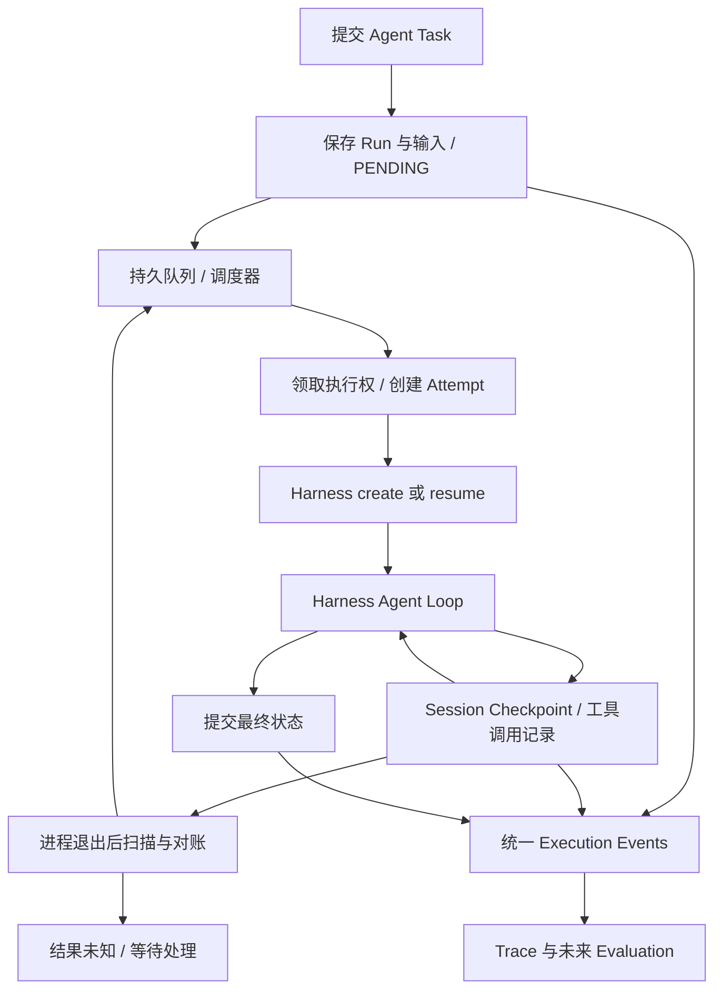

# Reliable Runtime 修改计划

**Goal:** 用户提交一次 Agent Task 后，由 Platform 负责排队、保存进度、恢复、重试和取消，使任务最终得到明确结果或明确的人工处理状态。

**Architecture:** DeepSeek Harness 保持唯一 Agent Loop；Platform 在外层维护 Run、执行尝试、调度所有权和恢复策略。复用 Session 日志、checkpoint policy、工具执行管线和 Agent resume，通过插件补充可靠性能力。

**Tech Stack:** 现有 TypeScript、Cordis、Storage Domain、Session Persistence、Typert Remote、React、Vitest。

**状态：** 2026-09-17 已实施单 Host 可靠执行主链路。实际交付、验证结果与延期项见 `../reliable-runtime-acceptance.md`；下文保留设计目标，不代表所有扩展项已经交付。

**实施调整：** 执行轮次保存在 Run.runtime.attempt，使用进程内执行槽和现有内核锁；没有引入独立 Attempt 表或数据库 TTL 抢占。工具尝试保留独立持久化日志。终态重试关联 API、全增量 Trace 投影与历史保留清理尚未实现；用户可通过新提交创建新 Run。

## 1. 产品问题与交付范围

当前 Run/State/Trace 回答“发生了什么”，本次增加“未完成工作由谁继续、从哪里继续、何时停止”的持久化规则。

可靠执行不等于任何任务都能成功。承诺在持久存储可用、执行服务重新启动、工具满足声明能力的条件下，任务不会因进程退出而静默丢失；每个任务能完成、明确失败、取消，或进入可解释的待处理状态。

第一版采用一个 Host、一个持久状态写入者、可配置数量的 Worker 执行槽。Worker 是运行时执行单元，第一版不要求每个 Worker 是独立进程。支持 Host 进程崩溃后重启恢复，以及主机重启且数据盘保留后的恢复。磁盘损坏、跨机器自动接管、独立 Worker 进程池不包含在第一版承诺内。

用户仍提交一个 Run，不另建重复的 Task 生命周期。自动恢复保持 runId、sessionId、agentVersionId 不变；每次获得执行权产生新的 attemptId。已经终结的 Run 不重新打开，用户重试终态任务创建带 retryOfRunId 的新 Run。

| 方案 | 收益 | 代价与决定 |
|---|---|---|
| 单 Host 调度器 + 持久队列 + 并发执行槽 | 复用现有存储与插件，先解决重启丢任务 | 不提供多 Host 高可用；本期推荐 |
| 多进程 Worker + 事务任务存储 | 独立进程隔离、跨进程领取 | 必须补充数据库 CAS、事务和所有写入路径的所有权校验；后续独立阶段 |
| 引入外部工作流/任务调度系统 | 获得成熟的分布式调度能力 | 新增基础设施且仍需解决 Harness 和工具恢复；本期不采用 |

## 2. 已核实的代码现状

以下现有代码位置用于实施定位。

| 位置 | 现状及差距 |
|---|---|
| `D:/developer/Platform/deepseek-harness-master/packages/business/agent-builder/src/platform-runs.ts` | start 先保存 Run，然后用内存 Promise 直接 launch；无持久领取机制。open/reconcile 将失去执行者的非终态 Run 标记 FAILED；close 也会把未完成工作结算为中断失败 |
| `D:/developer/Platform/deepseek-harness-master/packages/business/agent-builder/src/run-lifecycle.ts` | 根据 turn/start、turn/end 投影五种状态；目前 interrupted turn 会终结整个 Run，尚不支持同 Run 多次执行尝试 |
| `D:/developer/Platform/deepseek-harness-master/packages/business/agent-builder/src/run-schema.ts` | 有输入、结果、取消意图、Session 游标；events 最多 3 条，不适合直接扩展为无限增长的可靠执行日志 |
| `D:/developer/Platform/deepseek-harness-master/packages/session/session-checkpoint-policy/src/index.ts` | 已通过 llm/stream、tools/execute、agent/pre-step 在语义边界 flush；失败时阻止下游调用。工具结果持久化仍存在需要核实和缩小的窗口 |
| `D:/developer/Platform/deepseek-harness-master/packages/core/agent-loop/src/index.ts` | resume 先拿 Session 写权限、读取日志，再进行 interruptedTurnClosers 修复；支持恢复 Session，但不提供 Platform 调度 |
| `D:/developer/Platform/deepseek-harness-master/packages/core/session/src/repair.ts` | 区分 TOOL_NOT_STARTED 与 TOOL_OUTCOME_UNKNOWN；缺结果时生成合成工具错误、step/end、turn/end，不会自动精确重试原调用 |
| `D:/developer/Platform/deepseek-harness-master/packages/session/session-persistence-jsonl/src/index.ts` | 已有 Session 跨进程内核写锁；它保护 Session 文件，不等于保护 Run 领取和 Platform Domain 更新 |
| `D:/developer/Platform/deepseek-harness-master/packages/storage/storage-domain/src/domain.ts` | get 读取内存快照，update 在当前 Domain 写队列串行；不是跨进程 compare-and-swap |
| `D:/developer/Platform/deepseek-harness-master/packages/storage/storage-sqlite/src/unit.ts` | 当前 KV provider 写入记录，不提供任务条件领取事务；仅切换 SQLite provider 不会自动获得多 Worker 分布式互斥 |
| `D:/developer/Platform/deepseek-harness-master/packages/business/agent-builder/src/index.ts` | 已有版本固定、资源校验及受管 Session 操作限制；内部恢复必须增加明确的私有授权能力，不能放开普通 Session followup/修改入口 |
| `D:/developer/Platform/deepseek-harness-master/packages/business/agent-builder/src/platform-traces.ts` | Trace 来自 Run + Session；目前反复全量折叠和重写页面，长任务需要增量处理 |

## 3. 职责和运行路径



Harness 负责模型请求、工具循环、上下文重建和日志语义；Runtime 负责何时启动/恢复 Harness、预算、执行权、取消和最终 Run 状态；工具适配器负责执行幂等键、外部操作查询以及实际中止能力。

首版将调度实现拆为 agent-builder 内部模块，先保持现有 API 和插件入口。可靠性范围稳定、出现第二个业务调用方后，再考虑提取独立 platform-runtime 包，避免同时做大型包迁移。

## 4. Run 状态与持久化模型

沿用 PENDING、RUNNING、SUCCEEDED、FAILED、CANCELLED，新增 RETRY_WAIT、RECOVERING、BLOCKED。CANCELLING 作为 cancelRequestedAt 派生的展示阶段，避免重复维护一份取消状态。

- PENDING：请求已持久化，尚未被 Worker 领取。
- RUNNING：当前 Attempt 持有执行权。
- RETRY_WAIT：持久化 nextAttemptAt，等待下一次安全重试。
- RECOVERING：检查 checkpoint、工具结果和版本后恢复。
- BLOCKED：工具结果未知、人工审批或恢复前提缺失；worker 槽可释放，显示原因及允许的操作。
- SUCCEEDED / FAILED / CANCELLED：不可再执行的终态。

合法主路径为 `PENDING -> RUNNING -> SUCCEEDED`；可恢复中断为 `RUNNING -> RECOVERING -> RUNNING`；可重试错误为 `RUNNING -> RETRY_WAIT -> RECOVERING -> RUNNING`。任一非终态均可接收取消意图；预算耗尽或不可恢复错误进入 FAILED；结果未知不能通过自动重试退出 BLOCKED。

| 数据 | 最小字段与规则 |
|---|---|
| Run | 现有身份/输入/固定版本 + revision、attemptCount、nextAttemptAt、deadlineAt、latestCheckpointId、blockedReason、runtimePolicySnapshot、retryOfRunId |
| RunAttempt | attemptId、runId、workerId、ownerEpoch、startedAt、heartbeatAt、endedAt、outcome；区分崩溃恢复次数与失败重试预算 |
| Checkpoint | checkpointId、runId、sessionId、持久日志序号/版本、attemptId、configHash、创建时间、未完成工具引用；不复制完整聊天历史 |
| ToolInvocation | 稳定 invocationId、原 callId、工具及适配器版本、参数摘要/引用、能力声明、idempotencyKey、状态、重试次数、nextAttemptAt、最终标准结果引用 |
| RuntimeEvent | eventId、runId、attemptId、ownerEpoch、sequence、type、occurredAt、sourceRefs；Trace/Evaluation 共用事实源 |

ToolInvocation 状态至少区分 PREPARED、DISPATCHING、SUCCEEDED、FAILED、UNKNOWN。DISPATCHING 持久化后才允许进入工具体；它只能表示“可能已经发出”，不能证明外部系统已执行。

状态变化及对应 RuntimeEvent 必须原子提交。现有 Domain 没有多表事务，首版可使用单条带版本的控制记录保存一次有界 pending transition，再由可幂等重建的事件表归档；恢复必须重放未归档 transition 后才能产生下一条。不要分别写 Run 和事件后声称它们具备原子性，也不要在 Run.events 内无限追加。

同理，checkpoint 发布顺序为“Session flush 成功 -> 保存 checkpoint -> 发布 Run 游标”。Session 已落盘而游标未更新时，允许根据日志补齐；游标绝不能超过持久日志。恢复从最新有效持久前缀继续，不能回滚并丢弃 checkpoint 之后已保存的成功工具结果。

## 5. 修改任务与验收

每项按“先补行为测试 -> 最小实现 -> 相关测试通过 -> 更新说明”执行。下列新增文件名为计划位置，实施时避免覆盖同名既有文件。

### Task 1：先验证恢复扩展点，明确精确恢复所需最小改动

新增测试：`D:/developer/Platform/deepseek-harness-master/packages/business/agent-builder/tests/runtime-recovery.spec.ts`。

构造五个崩溃位置：接收 Run 后未建 Session、输入入队但未消费、模型已返回工具请求但未调用、工具执行后未写结果、最终答案已落盘但 Run 未结算。检查原始日志与 observeSession 的合成修复视图，恢复判定不能把合成错误当作真实执行失败。

优先验证 agent/*、tools/*、Session persistence 以及 agents.resume 能否完成所需恢复。当前 resume 的默认修复在 setup 前发生，单纯追加一个普通恢复提示无法保证原 callId 的精确续跑。

若实验确认现有插件无法在默认修复前补齐已知工具结果，则增加一个窄的、默认无行为变化的恢复扩展点：在持有 Session 写锁、读取原日志后、生成默认 closers 前，允许受管恢复插件提供经过校验的恢复结果/阻塞决定。恢复仍走 Harness 的日志校验和工具执行路径，Platform 不实现 LLM/Tool 循环。

候选改动：`D:/developer/Platform/deepseek-harness-master/packages/core/agent/src/index.ts`、`D:/developer/Platform/deepseek-harness-master/packages/core/agent-loop/src/index.ts`；必要时扩展 `D:/developer/Platform/deepseek-harness-master/packages/core/session/src/repair.ts` 的输入。实施前记录“为什么既有 hooks 不足”，同步 `D:/developer/Platform/deepseek-harness-master/docs/architecture.md`。这项验证通过前，不对外承诺精确恢复任意 pending tool。

验收：原有普通 Session 恢复语义不变；受管 Run 在首个恢复模型请求前已解决或阻塞全部不确定调用；缺失扩展支持时明确拒绝精确恢复，不能静默退化成重新执行整个任务。

### Task 2：持久队列与可恢复状态机

修改：`D:/developer/Platform/deepseek-harness-master/packages/business/agent-builder/src/platform-runs.ts`、`D:/developer/Platform/deepseek-harness-master/packages/business/agent-builder/src/run-lifecycle.ts`、`D:/developer/Platform/deepseek-harness-master/packages/business/agent-builder/src/run-schema.ts`、`D:/developer/Platform/deepseek-harness-master/packages/business/agent-builder/src/types.ts`。

新增：`D:/developer/Platform/deepseek-harness-master/packages/business/agent-builder/src/runtime-store.ts`、`D:/developer/Platform/deepseek-harness-master/packages/business/agent-builder/src/runtime-events.ts`。

start 只完成输入验证、版本固定、幂等接收和持久化，再返回 Run。调度器扫描可领取状态，不依赖请求处理 Promise 存活。消除“收到成功响应但进程退出后任务不会再启动”的窗口。

调整 projectRun：一条 turn/end 不再无条件等于整个 Run 终态，必须关联当前 attempt、恢复状态和结束原因；旧 attempt 的迟到回调不能终结新 attempt。保留已经写入的真实完成事实，恢复扫描先对账再决定是否启动。

验收：重复 token 返回同一个 Run；响应丢失后重提不重复入队；Run 已保存但尚未启动时杀进程，重启仍执行；最终答案已落盘的任务只补状态，不再调用模型。

### Task 3：Worker 领取、并发与所有权

新增：`D:/developer/Platform/deepseek-harness-master/packages/business/agent-builder/src/runtime-scheduler.ts`、`D:/developer/Platform/deepseek-harness-master/packages/business/agent-builder/src/runtime-worker.ts`、`D:/developer/Platform/deepseek-harness-master/packages/business/agent-builder/tests/runtime-scheduler.spec.ts`。

增加 maxConcurrentRuns、maxConcurrentRunsPerWorkspace、heartbeatInterval、stalledAfter、shutdownGrace 等验证过的 Cordis Config 字段。配置值由部署选择，不在模块中散落硬编码常量。

首版以单个 Runtime 写入者串行领取，生成递增 ownerEpoch；领取后所有状态结算都核验 attemptId/epoch。启动时对平台状态目录取得独占内核锁，防止第二个 Host 以独立 Domain 内存快照并发写同一队列。复用仓库已有锁能力，验证 Windows 和 Linux 释放语义。

heartbeat 用于检测疑似卡住，不能仅凭超时启动第二份执行。必须先确认旧执行停止、释放 Session 写锁，再接管。单进程 Worker 卡死且无法停止时 BLOCKED 或重启 Host，不允许一边旧工具仍运行一边新 Worker 重做。

验收：多个执行槽争抢同一 Run 只有一个成功；并发不超限；迟到结果不能覆盖新状态；第二个 Host 明确启动失败；崩溃后内核锁释放，重启可以接管。

### Task 4：Checkpoint 与 Harness 恢复适配器

新增：`D:/developer/Platform/deepseek-harness-master/packages/business/agent-builder/src/runtime-checkpoints.ts`、`D:/developer/Platform/deepseek-harness-master/packages/business/agent-builder/src/harness-runtime-adapter.ts`。

修改：`D:/developer/Platform/deepseek-harness-master/packages/business/agent-builder/src/index.ts` 中版本、资源与受管 Session 授权对接；需要增强通用 checkpoint 时，修改 `D:/developer/Platform/deepseek-harness-master/packages/session/session-checkpoint-policy/src/index.ts` 并保留普通会话语义。

checkpoint 覆盖：首次输入已接收、LLM 请求前、工具意图发出前、标准工具结果已形成后、step 完成、最终结算和优雅停机。工具结果需要在允许后续有副作用工具执行前得到持久化，不能只等到下一次模型请求。

恢复校验固定 Agent Version、configHash、工具/模型资源和日志格式；重新获取凭证，但不把凭证保存进 checkpoint。使用已有 durable inbox 与稳定 messageId 防止重复提交原始 prompt。已消费输入的恢复信号必须是去重、持久、可重放的控制输入，不能把原请求再当一个新用户任务提交。

两份存储间采用“工具调用记录先保存最终标准结果 -> Session 追加/flush tool/result -> 更新 checkpoint”的可对账顺序。中间崩溃只补日志，不重新执行工具。工具结果经过 post-execute 标准化，恢复不得跳过权限检查或改变正常模型可见输出。

验收：step1、step2 已完成时恢复不重复其工具副作用；并行工具调用中只处理未完成项；有结果记录但缺 Session 结果时补齐一次；损坏日志/不兼容版本明确阻塞或失败，不从头执行掩盖问题。

### Task 5：工具重试、幂等与未知结果处理

新增：`D:/developer/Platform/deepseek-harness-master/packages/business/agent-builder/src/runtime-tool-policy.ts`、`D:/developer/Platform/deepseek-harness-master/packages/business/agent-builder/src/runtime-tool-journal.ts`、`D:/developer/Platform/deepseek-harness-master/packages/business/agent-builder/tests/runtime-tools.spec.ts`。

工具适配器声明 readOnly、idempotent、supportsIdempotencyKey、supportsStatusQuery、supportsCancellation 等真实能力；未声明默认不可自动重放副作用。幂等键固定在逻辑 invocation 上，跨 attempt 不变；必须传到实际工具/数据库操作，仅在 Platform 本地保存键没有去重保证。不能只用参数哈希作为操作身份，两个内容相同的业务操作可能都应执行。

| 故障 | 处理 |
|---|---|
| 确认未发出 | 原调用可继续执行 |
| 已持久化成功结果 | 回放结果，不再执行 |
| 只读/真正幂等调用暂时失败 | 有界重试，指数退避与抖动，保存次数和 nextAttemptAt |
| 有外部幂等键支持、结果未知 | 同一键查询或重发，使用工具端去重语义 |
| 有查询能力、结果未知 | 先查外部操作状态，确认未执行才决定重试 |
| 无查询/幂等保证的副作用调用，结果未知 | BLOCKED，展示操作证据和人工处理入口 |
| 参数、权限、版本配置错误 | 不做自动重试，返回明确错误 |

复用 Harness 现有 LLM retry；增加工具执行重试和 Run 中断恢复，两层分别计数并受共同 deadline/预算约束。工具失败可能是可交给模型修正的业务结果，不应一律重启整个 Run。

重试必须通过真实工具执行入口，保留权限、超时、审计及取消检查；先测试 tools/execute waterfall 的重复委托语义，不能未经验证在循环里多次 next()。长退避释放执行槽，持久化到期点后经恢复路径重新进入；短等待也可取消。

嵌套工具、PTC、子 Agent 及外部异步作业没有完整调用身份/结果恢复支持时，按不可自动恢复能力处理，不能因顶层工具被标成幂等就重跑整棵调用树。

验收：退避期间杀进程不丢预算、不立即重试；外部操作已成功但本地未记结果时不产生重复写；持久化失败阻止新副作用；人工解除 BLOCKED 的重复请求不会多次执行。

### Task 6：持久取消、停机与长任务

修改：`D:/developer/Platform/deepseek-harness-master/packages/business/agent-builder/src/platform-runs.ts`；在 runtime-worker、runtime-checkpoints 内实现取消和停机策略。

先保存 cancelRequestedAt，再通知当前执行者。PENDING/RETRY_WAIT 可直接取消；RUNNING 调用 Harness cancel，传递 AbortSignal，停止后续模型/工具派发，等待实际工作停止后结算。恢复扫描先检查取消意图，取消中的任务不能被重新排队。

自然完成与取消竞争以持久提交顺序处理：已提交成功保持成功；先提交取消则停止后续工作，已经发生的副作用单独保留，不宣称回滚。工具不支持中止时显示“取消中/外部操作待确认”；超出宽限记录原因，不伪造已停止。远程操作未知可进入 BLOCKED，保留取消意图以禁止重放。

优雅停机停止接收/领取，等待或中断活动任务、flush，并保存可恢复状态。不能把所有 disposed 一律结算为 Run FAILED。必须 await 清理完成后才释放执行权与存储。

长任务使用语义 checkpoint + 有界周期 flush；heartbeat、运行 deadline、单次工具 timeout 分开。checkpoint 保存已提交事件，不承诺恢复未落盘的 token 流、函数栈、数据库连接或任意工具内部进度。工具自身若跑数小时，需要 externalOperationId 与查询/恢复适配器。加入存储不可用、磁盘满、checkpoint 大小限制和清理策略，保留活动 Run 恢复必需记录。

验收：取消排队/执行/退避/恢复中任务后均不再派发；取消后重启不复活；长工具忽略 AbortSignal 时状态真实；持续几小时的模拟长任务控制额外内存与写放大，重启可继续。Session 历史仍随必要事件增长，明确配置记录/字节预算及超限处理，不承诺任意长任务恒定内存。

### Task 7：统一事件、Trace 与用户入口

修改：`D:/developer/Platform/deepseek-harness-master/packages/business/agent-builder/src/platform-traces.ts`、`D:/developer/Platform/deepseek-harness-master/packages/business/agent-builder/src/trace-projection.ts`、`D:/developer/Platform/deepseek-harness-master/packages/business/agent-builder/src/trace-types.ts`、`D:/developer/Platform/deepseek-harness-master/packages/business/agent-builder/src/trace-schema.ts`、`D:/developer/Platform/deepseek-harness-master/packages/business/agent-builder/src/index.ts`。

事件增加 run.claimed、attempt.started/ended、checkpoint.saved、retry.scheduled、recovery.started/completed、cancel.requested、run.blocked；名称最终以统一事件定义为准。增加 attemptId、原 invocationId 和 sourceRefs，区分真实失败、崩溃后未知结果和恢复生成的日志。

Trace 以游标增量折叠并追加分页，仅在损坏或显式重建时全量扫描；Projection 故障不影响执行结果，执行必需的日志/调用记录写入失败则阻止继续执行。不能用 Trace 投影数据作为唯一恢复依据。

修改 UI：`D:/developer/Platform/deepseek-harness-master/packages/client/ui-agent-preset/src/client/AgentRuns.tsx`、`D:/developer/Platform/deepseek-harness-master/packages/client/ui-agent-preset/src/client/RunDetails.tsx`、`D:/developer/Platform/deepseek-harness-master/packages/client/ui-agent-preset/src/client/RunTrace.tsx`、`D:/developer/Platform/deepseek-harness-master/packages/client/ui-agent-preset/src/client/registry-client.ts`、`D:/developer/Platform/deepseek-harness-master/packages/client/ui-agent-preset/src/client/registry-locales.ts`。

显示“排队中、执行中、等待重试、恢复中、取消中、需要处理”，以及尝试次数、最后 checkpoint、下次重试时间。保留 runStart/runGet/runList/runCancel；按实际需要新增 runAttempts、runCheckpoints、runRetry、runResolve。所有操作保留 workspace/agent 权限校验；runResolve 要记录操作者、外部证据和幂等 token，不能是无条件“强制继续”。

验收：刷新页面与重启 Host 后状态一致；恢复仍是一条 Run；Trace/Evaluation 可从同一执行事实重建；多次恢复不会重复计算 token 或工具调用。

### Task 8：迁移、故障注入与发布

新增：`D:/developer/Platform/deepseek-harness-master/apps/cli/tests/reliable-runtime.expected.e2e.ts`、`D:/developer/Platform/deepseek-harness-master/apps/web/tests/reliable-runtime.e2e.ts`、`D:/developer/Platform/docs/reliable-runtime-acceptance.md`。进程级故障测试使用现有 expected 测试配置收集的 CLI 路径，单元测试继续放在能力所属包。

历史终态保持不变。旧非终态记录先对账真实完成结果；缺少恢复元数据、固定资源或幂等信息的旧记录不自动重放副作用，保留原行为或给出明确不可恢复原因。新行为通过 validated runtime mode 配置启用，新 Run 固定其策略；禁用功能只能停止新接收，不能删除活动 Run 的恢复数据。

真正启动测试 Host 进程，用 mock 模型和有可计数外部副作用的工具；在指定持久化窗口强制结束进程，再通过同一 dsh profile 重启。普通异常抛出测试不能替代硬崩溃测试。测试覆盖当前 Windows 环境及 CI Linux，使用独立临时数据目录和端口。

关键矩阵：

1. 接收前/接收后、Session 创建前/后、输入持久化前/后。
2. LLM 返回前/后、工具意图提交前/后、工具副作用后/结果提交前。
3. 并行工具部分完成、嵌套工具不可恢复、外部异步作业可查询。
4. 结果记录已保存但 Session 未追加、checkpoint 落后日志、最终答案后 Run 未结算。
5. 两个 Worker 同时领取、旧 attempt 迟到、Host 独占锁、Session 锁仍被占用。
6. 取消与领取、完成、退避到期竞争；重启遇到取消意图。
7. 存储写入失败、日志不完整、版本不兼容、资源撤销、预算耗尽。
8. 长任务增量 Trace、checkpoint 保留与大结果限制。

实施后的验证命令（在 `D:/developer/Platform/deepseek-harness-master` 执行，本次未运行）：

```powershell
pnpm exec vitest run packages/business/agent-builder/tests
pnpm exec vitest run packages/session/session-checkpoint-policy/tests packages/core/agent-loop/tests
pnpm exec vitest run --config vitest.expected.config.ts apps/cli/tests/reliable-runtime.expected.e2e.ts
pnpm run typecheck
pnpm run build
pnpm exec vitest run --config vitest.web.config.ts apps/web/tests/reliable-runtime.e2e.ts
pnpm run doc-sync
```

若修改 Session 恢复/模型可见事件，同步 TypeScript、Python SDK 的 keyless replay/expected fixtures，并运行对应选定快照；新增测试 fixture 按仓库实际 harness 规范落位。实施记录只报告实际执行的命令及结果。

## 6. 分阶段交付顺序

| 阶段 | 内容 | 出口标准 |
|---|---|---|
| A：可恢复任务骨架 | Task 1–4，先支持无未决副作用或已知结果的恢复 | 已接收任务不会因 Host 重启丢失；同 Run 不并发执行；原 prompt 不重复入队 |
| B：工具可靠执行 | Task 5–6 | 安全工具可恢复/重试；未知副作用被阻塞；取消与停机可持久恢复 |
| C：产品闭环与验收 | Task 7–8 | UI 状态可解释，Trace 同源，硬崩溃矩阵通过，迁移和发布策略明确 |

Task 8 的故障测试随每阶段逐步加入，不能等 UI 完成后才验证持久性。只有 A–C 全部完成，才能宣布本次可靠 Runtime 第一版完成。

## 7. 架构决定与后续边界

**ADR-1：复用 Harness Agent Loop。** 调度只调用 create/resume/cancel；精确恢复若缺扩展点，增加最小通用 hook，业务恢复策略留在 Platform。代价是需要专门验证 Harness 默认 crash repair 与平台工具记录的衔接。

**ADR-2：第一版单 Host 单写入者。** 复用当前 Domain 持久化，增加 Host 独占锁和执行槽所有权。代价是不提供多 Host 自动故障转移；heartbeat 不构成可以强行接管的租约。

**ADR-3：不承诺任意工具 exactly-once。** 执行尝试允许重复，已知结果只回放；业务副作用去重由工具端幂等或事务承担。无法确认结果的写操作必须阻塞，不能把风险交给 LLM 自行猜测。

**ADR-4：执行事实统一，恢复记录与查询投影分工。** Session 保存模型可见执行历史，Runtime 保存任务控制和工具恢复必要事实；Trace/Evaluation 从这两者投影，不再录制第三套执行历史。结果重复保存只用于弥合工具返回与 Session 追加之间的恢复窗口，提交后可转为引用。

后续需要独立进程或多机器 Worker 时，再引入具备事务和 CAS 的 RuntimeStore provider、原子 claim、leaseExpiresAt、数据库时间、续租和 fencing token。所有状态、工具派发及 Session 写入路径都必须能拒绝旧执行者；外部工具仍需幂等保证。跨机器接管还需要共享/可复制的 Session 与工具结果存储。不能把当前 KV 换成 SQLite 或仅增加 Redis 锁就声称完成这些保证。
