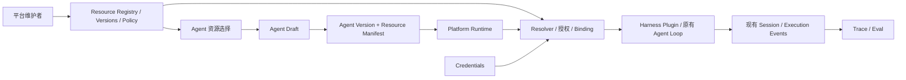

# Shared Resources Implementation Plan

**Goal:** 平台统一注册、发布、授权和维护共享资源，业务团队通过资源引用创建 Agent，无需重复接入服务和处理凭证。

**Architecture:** 新增独立的 Shared Resources Cordis 服务，管理资源元数据、不可变版本和使用策略；Agent Registry 保存引用，Agent Version 固定依赖，Runtime 在执行前解析并授权。通过现有 Tool、LLM、Skill、MCP 和 Credentials 扩展执行，保留 Harness Agent Loop。

**Tech Stack:** 当前仓库的 TypeScript、Cordis、Storage Domain、Zod/Schemastery、Typert Remote、React、Vitest。

**状态：** 2026-09-17 已按下述 Demo 范围完成 R1；[验收记录](../shared-resources-acceptance.md)。R2 MCP 和 Knowledge Source 尚未实施。以下保留完整设计及后续阶段安排。

## Demo 执行范围更新（2026-09-17）

用户授权直接实施，并明确不做鉴权。R1 省去登录、RBAC、身份 adapter 和多团队认证，Owner 仅作展示元数据。资源存储与管理类先位于现有 agent-builder 包内，保持独立 Storage Domain；Skill 首版为固定版本、预先加入系统提示的纯指令，不包含脚本/附件和按需加载。保留资源状态、版本固定、引用关系和凭证不进入 Agent 快照的规则。原计划中的安全/独立包设计作为后续参考，不作为本次验收要求。

## 1. 产品目标和交付边界

成功标准是：平台维护者接入一次资源，两个不同 Agent 能够独立引用同一个明确版本；平台可以查询使用者、发布新版本、停用旧版本，并在运行记录中追溯实际依赖。

建议拆成两个可交付增量：

| 阶段 | 完整交付 | 暂不交付 |
|---|---|---|
| R1：共享资源闭环 | Model、Tool、Skill 的注册、草稿、版本发布、授权、引用、执行、使用关系和资源中心 UI | 新模型厂商 Adapter、任意 API 接入生成器 |
| R2：MCP 资源纳管 | 复用现有 MCP 客户端，管理 Server 配置、凭证引用、发现和显式发布的 Tool | 完整 MCP 平台、OAuth 流程扩展、自动部署 Server |
| 后续 | Knowledge Source 的连接配置与受控查询工具依赖 | 本期不建设采集、切分、Embedding、向量库或完整 RAG |

Knowledge Source 不提供“可选择但无法执行”的占位能力；设计预留类型扩展点，只有完成对应 adapter 才对外开放。Credential 是资源背后的平台连接能力，不作为普通 Agent 作者可以任意挑选或读取的业务资源。

首版延续单写入 Host 和现有存储，不新增微服务、消息队列、Marketplace、计费、审批工作流、跨组织共享或多区域部署。平台维护者仍需首次安装/配置 Adapter，业务团队消费已接入资源；资源注册本身不能让尚不存在的工具实现自动可执行。

## 2. 当前代码和可复用能力

下列源码路径均相对于 `D:/developer/Platform/deepseek-harness-master/`。

| 位置 | 已有能力 | 需要改变的部分 |
|---|---|---|
| `packages/business/agent-builder/src/definition.ts` | `TOOL_CHOICES` 固定 11 个工具，按 group 渲染业务插件 | 新 Agent 改读 Resource Catalog；旧格式保留为兼容读取/执行路径 |
| `packages/business/agent-builder/src/types.ts` | Agent 保存 `model: {provider, model}` 和 `toolIds` | 新配置保存明确的资源版本引用 |
| `packages/business/agent-builder/src/registry.ts` | 草稿、revision、归档和存储 | 增加资源引用字段和校验；不要在这里实现通用资源管理 |
| `packages/business/agent-builder/src/versions.ts`、`version-schema.ts` | 不可变快照、hash、幂等保存 | 新格式冻结资源依赖清单，保留旧格式及旧 hash 算法 |
| `packages/business/agent-builder/src/version-preset.ts` | 每个 AgentVersion 对应不可变 Preset | 增加受控资源绑定插件，不把秘密渲染到文件 |
| `packages/business/agent-builder/src/platform-runs.ts` | Run 固定 AgentVersion，落盘后启动 Session | 加入资源授权、manifest 和失败归因，保留原有状态机 |
| `packages/business/agent-builder/src/platform-traces.ts`、`trace-projection.ts` | 现有 Run/Session 执行事实投影 | 扩展资源关联，避免另建工具执行日志体系 |
| `packages/core/tools/src/index.ts` | scoped 注册、`restrict()`、单调拒绝的 `guard()`、执行 hooks | 用插件限制可见工具并在调用前强制授权 |
| `packages/mcp/mcp-client/src/` | stdio / Streamable HTTP、发现、重连、超时、工具桥接 | 管理配置来源和发布范围，不重写协议 |
| `packages/credentials/credentials/src/`、`credentials-local/src/` | CredentialRef、记录、只含状态的 CredentialInfo | 加一层平台连接引用和管理权限，复用秘密解析能力 |
| `packages/skill/skill/src/index.ts` | scoped skill/provider 注册、加载和 invocation policy | 提供固定版本的 Skill 内容，隔离非绑定 Skill |
| `packages/client/ui-agent-preset/src/client/` | Agent 表单、Registry、Versions、Runs | 资源选择器和依赖展示，复用现有 UI/Remote 模式 |

当前 `RegistryWorkspace.accessMode` 明确是 `shared-host`，Owner 由 Host 配置，写入者默认 `shared-host`。这不是已认证团队目录。现有 Credentials 中的 authorization 主要负责获取上游凭证，也不能当作平台 RBAC。

## 3. 架构选择

| 方案 | 代价与收益 | 结论 |
|---|---|---|
| 继续在 AgentBuilder 内扩展静态 Catalog | 初期改动少，但资源仍跟着 Agent 发布，难以独立维护 | 不选 |
| 独立 Cordis 资源服务 + 持久化 + 受控绑定插件 | 复用当前部署和存储，资源与消费者职责清晰 | 推荐 |
| 独立资源中心服务 + 远程 Gateway | 可独立扩缩容，但增加部署、认证、分布式一致性成本 | 当前规模不需要 |



- Control Plane 管资源生命周期、Owner、授权、版本、引用关系。
- Resource Resolver 管引用解析、依赖校验和执行绑定；不运行 LLM/Tool 循环。
- Runtime 管 Run 生命周期、固定依赖和执行准入；失败使用现有 Run 错误与状态机制。
- Harness 继续拥有模型交互、Skill 加载和工具执行。
- 第一阶段新增一个 `packages/business/shared-resources` 包即可；按文件区分 Registry、Policy、Resolver、Adapters，不为每类资源拆微服务。

## 4. 资源数据模型

以下是拟议数据契约。实现时使用仓库 Branded ID、判别联合和严格 schema；不要把资源配置实现为可执行的任意 JSON。

| 实体 | 主要字段 | 语义 |
|---|---|---|
| `Resource` | id、workspaceId、kind、slug、name、description、ownerTeamId、tags、status、revision、审计字段 | 稳定身份；slug 在 Workspace 内唯一，引用使用 id |
| `ResourceDraft` | resourceId、revision、typedSpec | 可编辑的下一版本配置；普通保存不发布 |
| `ResourceVersion` | id、resourceId、versionNumber、schemaVersion、typedSpec、dependencies、specHash、changeNote、createdBy/At | 发布后不可修改；`v1` 只是展示号 |
| `ResourcePolicy` | resourceId、policyRevision、grants、disabledVersionIds | 单独可变，撤权无需篡改旧版本 |
| `ResourceRef` | resourceId、versionId | Agent 精确引用，禁止持久化 `latest` |
| `ResolvedResourceManifest` | refs、传递依赖、hash、adapter 标识、有效非秘密参数、toolName 映射 | 随 AgentVersion 固定；Run 引用并校验 |
| `ConnectionBinding` | id、workspaceId、适用 adapter、非秘密连接信息、credentialRef、状态 | 管理员维护；秘密仍存既有凭证后端 |

版本内的连接目标/路由和 credential 引用需要固定；密钥实际值可在同一引用下轮换。修改 endpoint、模型路由、credentialRef 或执行参数需要新资源版本，不得借“修改连接”静默改变旧版本行为。对现有 Host model route 尚不能冻结的内容，记录 fingerprint 并在漂移时阻止执行，不能声称冻结了实际模型权重。

各类 `typedSpec` 的最小内容：

- **Model：** 已安装的 provider adapter、provider/model 路由、连接引用、受支持的默认参数。R1 用平台资源统一选择；新增 provider 继续由平台维护者接入。
- **Tool：** 受信 adapter key、底层 operation、参数/输出 schema、非秘密配置、timeout、能力声明。内置工具先映射到现有 business-tools，不接受用户输入 npm 包路径或 `!!js`。
- **Skill：** 名称、描述、invocation policy、不可变 Markdown 内容及 content hash。R1 仅支持纯指令型 Skill；含脚本/附件的 Skill 在具备完整 bundle 归档与校验后再支持，不能只固定本地目录路径。
- **MCP Server（R2）：** transport、受控 URL 或平台批准的 stdio 启动配置、credentialRef、超时/重连策略。发现的 Tool 作为独立 Tool 资源发布，精确依赖 ServerVersion 和 raw tool name/schema hash。
- **Knowledge Source（后续）：** 连接/collection 配置，由查询 Tool 精确依赖；固定配置版本不等于固定动态知识内容。

`permission: read-only` 拆为两件事：使用授权（谁能使用）和实际能力（工具能做什么）。read-only 必须由实现、上游凭证 scope 或数据访问策略保障，不能仅靠名称、描述或 Prompt。

## 5. Agent 如何引用和固定资源

业务展示示例：

```yaml
name: sre-agent
model: deepseek-chat:v1
uses:
  tools:
    - redis-diagnose-tool:v1
  skills:
    - incident-triage:v1
```

后端将展示名解析为不可变 `resourceId + versionId`。结构化输入建议为 `resources: { model: ResourceRef, tools: ResourceRef[], skills: ResourceRef[] }`，暂不提供无类型的 `uses: string[]` 作为权威存储。

执行链路：

1. 草稿保存：校验资源存在、kind 正确、Workspace、版本状态和该 Agent 所属团队的使用授权。
2. 保存 AgentVersion：在捕获同一草稿 revision 后解析依赖闭包，检测缺失依赖、环和工具名冲突，固定完整 manifest 与非秘密执行配置；hash 包含这些行为字段。
3. 部署/回滚：重新校验当前策略及实现可用性；先生成完整版本产物再切换部署指针。失败保留旧部署。
4. 接受 Run：固定 AgentVersion 和已保存 manifest，记录执行主体、资源版本/hash 和准入 policyRevision。先持久化 Run，后启动 Harness；资源准备失败保留明确的 FAILED 原因。
5. 真正调用前：针对受管 Run 重新检查资源禁用/授权状态，随后仅从绑定 manifest 获取路由和工具实现。禁止回退至最新资源或全局默认模型。
6. 同一 requestToken 重试返回同一条资源版本、AgentVersion 或 Run；不会因资源后来升级而重新选择依赖。

发布 Tool v2 不会改变引用 v1 的 Agent，也不会自动生成 AgentVersion。业务团队显式升级草稿，再保存版本、部署；UI 可提示新版本但不自动更新。

资源版本冻结的是平台配置和可用的实现标识。远端 API 行为、模型权重、实时数据仍可能变化；记录实际 provider/model、MCP schema 指纹等事实，避免承诺绝对重放。

## 6. 生命周期、权限与凭证

### 6.1 生命周期

| 动作/状态 | 新引用 | 已保存 AgentVersion 部署与新 Run | 在途 Run |
|---|---|---|---|
| 草稿 | 不可引用 | 不可用 | 无影响 |
| active / published | 可引用指定已发布版本 | 正常授权后可用 | 固定版本执行 |
| deprecated | 新增绑定被拒绝，既有草稿可保留并显示提示 | 允许既有引用执行/回滚并提示 | 继续 |
| disabled（资源或版本） | 拒绝 | 拒绝 | 下一次相关模型/工具/Skill 访问拒绝 |
| archived | 目录默认隐藏，拒绝新引用 | 拒绝 | 与 disabled 相同 |

首版不提供已发布资源/版本物理删除。保留历史快照、审计和引用关系；不能以已禁用为由使历史 AgentVersion/Run 页面无法读取。禁用/撤权成功之后才开始的调用必须拒绝；已经发出的远端请求只做尽力取消，不承诺撤销已发生副作用。已注入上下文的 Skill 内容不能收回。

### 6.2 最小授权

拆分平台管理员、Owner team 管理者、资源使用者。权限至少区分 `view`、`use`、`manage`；凭证设置/轮换只给受信平台维护者。使用资源不意味着能够读取秘密或修改连接。

R1 增加独立的服务端 `ResourceAccessContext`/Policy 接口，包含 actor、workspace、team 和权限来源。主体不能来自浏览器提交的 `ownerTeamId`。Agent 的编辑/运行权限、Agent 所属团队能否使用资源、资源传递依赖能否被使用必须一起校验，避免通过他人的 Agent 间接取得资源。

当前无已认证多团队主体，实施分两种明确模式：

- 默认 shared-host 模式：可信 Host 配置指定一个操作者/团队；策略真实执行，但不能宣称隔离同一 Host 上的不同浏览器用户。管理员操作仅开放给受信 Host 管理入口。
- 真实多团队启用前：接入服务端验证的身份 adapter（可由已有可信认证入口提供）；未配置时拒绝启用多团队管理权限。身份来源与当前 Remote request context 的衔接列入 Task 1 探查项，不以伪造 teamId 的演示替代认证。

不在本功能内建设完整用户中心/SSO，但若首轮验收要求两个真实团队在同一 Host 自助操作，身份 adapter 是必需前置工作，不能推迟后仍声称多团队权限已完成。

### 6.3 凭证处理

复用 Credentials 保存和解析秘密，只将不含秘密的引用、状态和来源投影到资源 UI。Agent 作者不填写 API key；发布快照、生成的 Preset、Run、Trace、错误、日志不得保存 key/token/header 明文。credentialRef 的可用性也必须由资源管理权限控制，不能允许消费者提交任意 Host 环境变量名。

本期优先使用平台现有凭证配置入口；是否增加资源中心内的受限“设置凭证”表单，以 Task 1 的认证能力为前提。不要把所有底层 Credentials Remote 写接口自动暴露给团队。

## 7. Harness 适配的具体边界

**Tool：** 在受管 Agent scope 内只注册绑定的 Tool。`tools.restrict()` 仅过滤全局工具，对 scoped 注册无效；因此不能仅加 allowlist 就宣称隔离完成。用 `tools.guard()` 检查受管 Run 的 manifest 和最新的已提交策略，覆盖直接工具调用以及 PTC 子调用。没有 manifest 的普通 Harness Session 保持原行为；受管资源不能通过普通 Session 获得越权访问。

**Model：** 扩展现有 `api-session/initial-model` 和 `agent/request` 适配，使用 manifest 内的模型绑定与参数；执行前检查权限及连接状态。验证 Host route 重配、同资源两个版本并行运行时不串路由、不串 credential；避免修改共享全局默认模型。

**Skill：** 通过现有 Skill service/provider 注册固定内容，关闭受管组合中的项目/用户目录自动发现，并验证全局 Skill 不会混入。需要隔离服务实例或受限 provider 视图时，优先用 Cordis 组合完成。仅注册选中 Skill 不等于自动屏蔽其他 provider。

**MCP：** 当前桥接会同步 Server 的工具列表。R2 的发现结果先供管理员选择发布；Agent 仅获得已绑定 Tool 的 schema 和执行权。重连/`tools/list` 更新不能自动扩大授权或替换固定 schema。若现有桥接无法在注册前过滤 scoped MCP Tool，可在 `mcp-client` 增加默认行为不变的可选工具选择/固定 schema 检查扩展；先证明插件方式不可行，再做最小修改，不能改 Agent Loop。

新功能的关键验证是“两个 Agent/版本同时运行互不污染”，包括工具名、Skill 名、模型路由和凭证。连接池和跨 Agent 复用进程留到后续；首版宁可作用域内独立连接，避免凭证和上下文串用。

## 8. 存储、引用关系、审计和兼容

- 沿用 Storage Domain 和单写入 Host。首版资源聚合记录包含元数据、草稿、版本、策略与操作回执；一次 update 提交一次管理变更及审计事实。资源名唯一性通过同一 Registry 写队列/索引维护；业务请求包含 expectedRevision 和 requestToken。
- 资源使用关系从 Agent 草稿、AgentVersion manifest 和 ResourceVersion dependencies 推导，返回 Agent/version/部署状态及依赖路径。首版可按 Workspace 扫描并缓存；不要以单独写入的反向索引作为唯一事实来源。Run 使用从现有 Run 关联取得。
- 首版不需要跨模块事务：先有资源版本才可被引用，不物理删除；在保存 AgentVersion、部署提交和实际调用前重验状态。资源停用/撤权与授权读取通过服务端策略服务排序，明确“更新提交后新调用被拒绝”的生效点。
- 管理审计记录注册、草稿更新、版本发布、授权变化、弃用/禁用、凭证轮换的引用和操作者；不记录秘密。执行审计继续使用 Session/Run/Trace，补资源版本映射，避免第二套执行记录。
- 新 AgentVersion 使用 `schemaVersion: 2` 和对应 renderer；保留 v1 schema、hash、renderer 和已有产物。不要对旧快照追加字段后重算 hash。
- 迁移先幂等注册现有 11 个业务 Tool 与已配置 Model，再将可编辑草稿迁到精确资源引用。保留 Agent ID、部署、旧 AgentVersion 和 Run；旧版本详情显示“legacy 未固定共享资源版本”。
- legacy 新运行通过受控兼容映射获得资源策略检查并记录迁移来源，不能把历史未知资源版本伪装成已固定；无法唯一映射就明确拒绝新运行并要求生成新版，历史仍可读。映射必须防止旧工具入口绕过新禁用策略。

## 9. 修改任务和验证顺序

下面新增文件均为拟议路径；已有路径已核对。每项按“先写行为测试 → 验证失败 → 最小实现 → 验证通过”的顺序执行，提交保持可独立审查。

### Task 1：验证扩展点，确定权限模式

**检查：** `packages/core/tools/src/index.ts`、`packages/skill/skill/src/index.ts`、`packages/mcp/mcp-client/src/{index,tools,connection}.ts`、`packages/api/gateway/src/{index,types}.ts`、`packages/business/agent-builder/src/index.ts`。

**新增测试：** `packages/business/shared-resources/tests/binding-seams.spec.ts`。

1. 用最小 Cordis fixture 验证工具 guard、全局/scoped 可见性、Skill 隔离与同名资源并行绑定。
2. 确认模型 provider/凭证路由能否按绑定隔离；列出不可冻结的 Host 参数。
3. 确认受信主体到 Remote 调用的注入方式；记录 shared-host 与 authenticated 模式的启用条件。
4. 记录 MCP 发布范围控制的最小扩展方案和无需改 loop 的证据。

**验收：** 能拒绝未绑定能力和跨 scope 调用；探查失败先调整 adapter 设计，不直接修改 loop。

### Task 2：资源 Registry 与生命周期

**新增：** `packages/business/shared-resources/package.json`、`tsconfig.json`、`tsdown.config.ts`、`src/{index,types,schema,registry,versions}.ts`、`tests/{registry,versions}.spec.ts`。

1. 按现有包模板接入 workspace/build/type generation，定义三种 R1 typedSpec。
2. 实现注册、列表/详情、草稿更新、发布、弃用、禁用、归档和管理审计。
3. 实现 revision 冲突、发布序号、相同 token 重试和重启恢复。
4. 提供资源与资源版本列表 API；历史读取与当前可执行性校验分开。

**验收：** 两个并发发布无重复编号；重试不多发版本；存储失败不返回成功；已发布 spec 无更新接口。

### Task 3：使用策略和连接引用

**新增：** `src/{policy,connections}.ts`、`tests/{policy,connections}.spec.ts`（均在 shared-resources 包下）。

**复用：** `packages/credentials/credentials/src/` 的公共 API。真实多团队模式所需身份 adapter 按 Task 1 确认的入口实现。

1. 实现服务端 actor/team/workspace 注入和 view/use/manage 检查。
2. 校验 Agent 管理/运行权限与资源传递依赖授权，默认拒绝未知主体。
3. 提供连接的安全状态投影和 Host 内部凭证解析。
4. 验证伪造 ownerTeamId、猜测 resourceId、直接调用 Remote、读取其他资源凭证均不能越权。

**验收：** revoke 提交后新调用拒绝；秘密不出现在 API 响应、持久化快照、产物或错误输出中。

### Task 4：Resolver 与 R1 绑定插件

**新增：** `src/{resolver,binding,manifest}.ts`、`src/adapters/{builtin-tool,model,skill}.ts`、`tests/{resolver,binding}.spec.ts`。

1. 解析精确引用、kind、依赖闭包和 hash，拒绝环、缺失依赖、不可用 adapter 和工具名冲突。
2. 基于受信 adapter catalog 生成执行描述；用户配置只能填入已定义 schema。
3. 通过已有注册、guard 和模型 hooks 挂载能力，scope dispose 时完整释放。
4. 为模型请求、工具执行和 Skill 读取加入策略生效点；R1 不引入工具自动重试策略变化。

**验收：** 同时运行两个 Agent/版本，工具、模型参数、凭证和 Skill 内容互不污染；资源下线不回退到默认配置。

### Task 5：Agent 引用、版本与迁移

**修改：** `packages/business/agent-builder/src/{types,definition,registry,versions,version-schema,version-preset,index}.ts`；对应 `tests/{registry,versions,authoring}.spec.ts`。

**新增：** `packages/business/shared-resources/src/seed.ts`、`packages/business/agent-builder/src/resource-migration.ts`、`tests/resource-migration.spec.ts`。

1. 新格式使用资源引用，Catalog 由资源服务提供；静态 TOOL_CHOICES 退为受信 seed/legacy 输入。
2. 新 AgentVersion 固定 manifest，新增 schema/renderer 分支，保留 v1 验证。
3. 完成幂等 seed、草稿迁移和 legacy 运行兼容映射，提供失败诊断。
4. 部署和回滚都重验依赖，成功前不改变部署指针。

**验收：** Tool v2 发布后旧 AgentVersion 仍使用 v1；重启/重复迁移不产生重复资源；旧 hash、版本详情与 Run 保持可读。

### Task 6：Runtime 与 Trace 资源归因

**修改：** `packages/business/agent-builder/src/{platform-runs,run-schema,types,platform-traces,trace-types,trace-schema,trace-projection}.ts`；`tests/{run-lifecycle,trace-projection}.spec.ts`。

1. Run 持久化 manifest 身份、执行主体与授权 revision；缺失/禁用资源保留可读错误码。
2. 扩展现有 Session 执行事实与 Trace 投影，关联工具调用名和 resource/version，记录实际模型路由。
3. 新增 durable 事件或字段时按仓库 Session 兼容规则处理，并更新相应消费者/fixtures；不直接改写历史日志。
4. 验证资源准备失败、取消、启动中断、禁用并发、Run token 重试和历史投影。

**验收：** 每次受管调用可追溯资源版本；不重复记录 LLM/Tool 执行，不误报成功，不重放有副作用的工具调用。

### Task 7：资源中心和 Agent 选择界面

**新增：** `packages/client/ui-agent-preset/src/client/{SharedResources,ResourceDetails,ResourcePicker}.tsx`、`shared-resources-client.ts`、`shared-resources-locales.ts`、对应 CSS。

**修改：** 同目录 `index.ts`、`AgentRegistry.tsx`、`AgentBuilder.tsx`、`AgentVersions.tsx`、`RunDetails.tsx` 及相关 store/types；Remote 客户端类型按既有生成流程更新。

1. 增加“资源中心”：按类型/Owner/状态筛选，展示版本、连接状态、使用者和受权操作。
2. 详情支持草稿保存、发布、弃用/禁用、使用关系和安全配置查看；权限同时在服务端执行。
3. Agent 创建/编辑选择 Model、Tool、Skill 及明确版本，保存前显示不可用依赖。
4. AgentVersion/Run 展示已固定资源，新版提示与当前绑定分开；业务作者无需看到 adapter 路径或填写 API key。
5. 所有文案进入现有 typed locale 字典，增加 Web 快照。

**验收：** 平台维护者注册一次，业务作者通过选择器创建两个复用同一资源的 Agent，并能从资源页反查两者。

### Task 8：组合接入、文档与 R1 验收

**修改：** `packages/bundle/business-agents/cordis.patch.yml`、对应 `package.json` 和 `tests/composition.spec.ts`；新包 README/JSDoc、相关现有包 README。

**新增：** `apps/web/tests/shared-resources.e2e.ts` 及 owner-local snapshots、`docs/shared-resources-acceptance.md`（Platform 根目录）和 Harness 要求的 Agent Note。

按仓库规则维护 manifest、依赖、Host/Client 编译面与生成物。完成下节检查，记录实际命令、结果和未覆盖的部署条件。真实多团队模式未接入时明确标注，不能将 shared-host UI 演示算作认证隔离验收。

### Task 9：R2 MCP 纳管

**新增：** `packages/business/shared-resources/src/adapters/mcp.ts`、`tests/mcp-binding.spec.ts`。

**按 Task 1 结论最小修改：** `packages/mcp/mcp-client/src/{index,tools,connection}.ts` 和相应测试；扩展资源表单和类型。

1. 管理员创建 MCP Server 草稿并设置连接/credentialRef，主动触发连接发现。
2. 发现只生成候选项；显式发布 ServerVersion 与 ToolVersion 后才出现在可选资源中。
3. Agent 按 ToolVersion 消费；Server 本身不授予整个目录的执行权，依赖闭包统一校验。
4. 用本地 mock MCP 验证超时、重连、目录扩大、schema 漂移、同名工具和禁用；不依赖真实 API key。

**验收：** 两个 Agent 复用同一个 MCP 来源的已发布工具，不必各自配置 URL/header；Server 新增工具不会被自动暴露；schema 漂移明确拒绝并提示发布新版本。

## 10. 检查命令与业务验收

在 `D:/developer/Platform/deepseek-harness-master/` 执行；以下是实施后的计划命令，本次规划没有运行测试：

```powershell
pnpm run test -- packages/business/shared-resources/tests packages/business/agent-builder/tests packages/bundle/business-agents/tests
pnpm run typecheck
pnpm run lint
pnpm run build
pnpm run test:web:built -- apps/web/tests/shared-resources.e2e.ts apps/web/tests/agent-registry.e2e.ts apps/web/tests/agent-version.e2e.ts
pnpm run doc-sync
```

涉及 MCP 时追加该包相关测试；涉及模型可见内容/Session 事件时增加 keyless recorded-session snapshot，按仓库要求更新 SDK 对应期望。不默认运行全仓覆盖率或真实付费模型调用。

R1 必过场景：

1. 平台维护者登记 Model、Tool、Skill；Agent 作者无 adapter/API key 配置即可创建并运行 Agent。
2. 两个 Agent 引用同一 Tool v1；工具只接入一次，资源页能列出两者及历史版本引用。
3. 发布 Tool v2 后两者仍使用 v1；只升级一个 Agent，另一个及其在途 Run 不受影响。
4. 无权限引用、跨 Workspace、伪造团队、绕过 UI 的调用均在服务端失败；不能通过间接依赖绕过。
5. deprecated 保留旧引用可用；disabled 阻止新部署/Run及后续相关调用，历史依然可查看。
6. 密钥轮换无需修改 Agent；AgentVersion/Preset/Run/Trace/报错不出现明文密钥。
7. 版本发布/部署并发、重启和同 token 重试不产生错误引用；存储失败不启动无记录执行。
8. 新旧 AgentVersion 共存、历史 hash 不变、迁移可重复；既有相关测试通过。

## 11. 关键决策记录

- **ADR-1：资源生命周期独立于 Agent。** 独立服务让多个 Agent 消费同一资源；代价是增加解析和引用校验，但避免继续把目录维护塞入 AgentBuilder。
- **ADR-2：明确版本 + AgentVersion manifest。** 提供可追溯依赖与显式升级；代价是需要维护旧 adapter/格式和迁移，而非 `latest` 自动更新。
- **ADR-3：配置不可变，策略与密钥值可变。** 保留配置归因，同时支持紧急撤权与密钥轮换；代价是旧版本不保证永远可运行，运行前必须检查。
- **ADR-4：复用 Harness 扩展与现有执行事实。** 降低改造风险并保持单一 Agent Loop；MCP 注册范围等缺口仅在证明确有必要时做兼容扩展。
- **ADR-5：先单 Host，权限不冒充身份。** 满足当前工程规模；真实多团队自助运行必须补可信身份来源，不能把 Owner 字段当认证。

建议以 R1 为第一轮实现目标，验收后推进 R2；Knowledge Source 在已有查询场景和 adapter 时再接入同一资源模型。
