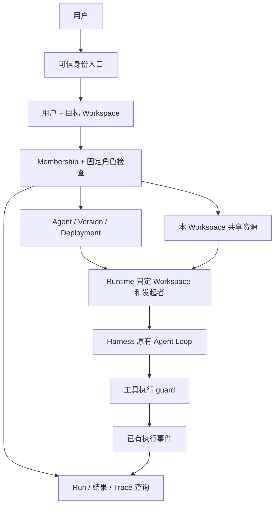

# Workspace / Governance Implementation Plan

> 状态：2026-09-17 已完成首版实现和功能验收。实际交付、命令和检查限制见 [验收记录](../workspace-governance-acceptance.md)。以下保留设计依据；计划中的测试拆分以验收记录为准。

**Goal:** 让销售、运维、财务等团队共享同一 Platform，以 Workspace 隔离成员、Agent、共享资源和运行数据，以三个固定角色支持协作。

**Architecture:** 在 Platform Control Plane 增加 Workspace、Membership 和集中权限检查，复用现有 Storage Domain、Agent Registry、Shared Resources 和 Runtime。身份通过服务端可信上下文进入平台；Runtime 传播 Workspace 与发起者，Harness 仍执行原有 Agent Loop，通过现有授权 hooks 和 `tools.guard()` 落实执行权限。

**Tech Stack:** 当前仓库 TypeScript、Cordis、Storage Domain、Zod / Schemastery、Typert Remote、React、Vitest，以及已有 JSON / SQLite 存储适配能力。

**范围与假设：** 单公司、单写入 Host、多用户、多 Workspace；不引入独立微服务。首版默认采用管理员预置用户和独立访问凭证的轻量身份方案；已有公司登录时替换身份适配器。模拟用户只能作为测试 / Demo 模式，不能作为真实多人隔离的验收依据。

**代码基线：** 2026-09-17 当前工作区，包含尚未提交的 Reliable Runtime 和 Shared Resources 实现。开始实施前确认这两部分的最终接口；不覆盖现有改动。

---

## 1. 产品范围与架构归属

首版完成以下闭环：维护者创建 Workspace → 管理员添加成员并分配角色 → 管理员配置本 Workspace 的资源 → 开发者协作创建、修改和部署 Agent → 普通用户调用已部署 Agent → 各角色只查看允许访问的运行数据。

| 实施前问题 | 本期结论 |
|---|---|
| 解决什么产品问题？ | 多个团队共用服务时，资源、操作权限和运行数据有明确归属。 |
| 哪一层负责？ | Control Plane 负责成员和授权；Runtime 负责执行上下文和恢复授权；资源执行适配器负责工具侧校验。 |
| Harness 已提供什么？ | Storage Domain、Remote、Session、工具 guard、Session / Preset 授权 hooks、现有执行事件。 |
| 能否用插件实现？ | Workspace 和策略使用 Cordis 插件；复用现有业务包，不改 Agent Loop。请求身份透传需先验证运输层扩展点。 |
| 最小实现是什么？ | Workspace + Membership + 三个固定角色 + 统一服务端检查 + 数据查询隔离 + 最小 UI 与越权测试。 |

Company 在首版等于平台部署本身，不新增 Company 管理、组织树、独立 Team 表、自定义角色、权限继承、单资源 ACL、审批流、SSO、SCIM、计费或跨 Workspace 共享。当前 `ownerTeamId` 保留为兼容展示元数据；它不决定权限。

Workspace 代表一个协作团队。一个用户可以加入多个 Workspace，并在不同 Workspace 担任不同角色。创建 Workspace 和预置用户先由 Host 维护者通过受控初始化工具完成；Workspace 管理员只能管理自己 Workspace 中的成员，不能创建全局管理员。

## 2. 当前实现与需要补齐的地方

下列代码路径相对于 `D:/developer/Platform/deepseek-harness-master/`；计划文件及验收文档位于外层 `D:/developer/Platform/docs/`。

| 位置 | 当前情况 | 本期改造 |
|---|---|---|
| `packages/business/agent-builder/src/types.ts` | Agent、Version、Deployment、Run 已有 `platformWorkspaceId`；Agent 有 `createdBy` / `updatedBy`。 | 复用现有字段，补充真实用户与成员关系；避免并列新增一个同义 `workspace_id`。 |
| `packages/business/agent-builder/src/registry.ts` | `assertWorkspace()` 只接受 Host 配置的一个 Workspace，默认写入者是 `shared-host`。 | 改为已授权的多 Workspace 操作，保留 revision 并发控制。 |
| `packages/business/agent-builder/src/shared-resources.ts` | 实例固定一个 Workspace；`list()` 当前遍历并返回全部资源行。 | 所有列表、详情、发布、使用关系和引用解析必须显式限定 Workspace。 |
| `packages/business/agent-builder/src/index.ts` | 聚合 Agent、Version、Deployment、Run、Resource Remote；部分资源 API 没有 Workspace 参数。 | 统一解析身份与授权，覆盖旧 `catalog/get/create` 等兼容入口。 |
| `packages/business/agent-builder/src/platform-runs.ts`、`runtime-tools.ts` | 已有排队、重试、恢复、Session 对应关系和工具执行记录。 | 固定发起者、传播 Workspace；启动、恢复、工具调用前重新检查权限。 |
| `packages/business/agent-builder/src/platform-traces.ts` | 根据 Run / Session 生成 Trace。 | 先授权 Run，再读 Trace；普通用户单独返回结果投影。 |
| `packages/client/ui-agent-preset/src/client/registry-client.ts` | Run 可通过 `openRun` 打开原生 Session。 | 限制原生 Session 的读取入口，首版普通用户使用受控 Run 结果页。 |
| `packages/workspace/workspace/src/types.ts` | Workspace 以目录路径和 Session 列表为中心。 | 保持原义，不能直接充当组织权限边界。 |
| `packages/client/connection/src/browser-auth.ts`、`rpc-host.ts` | Host 访问凭证 / 浏览器认证，不是 Workspace 成员目录。 | 不将“能访问 Host”视为“有权访问全部平台数据”。 |
| `packages/core/tools/src/index.ts` | 已有 `restrict()` 和实际调用前的 `guard()`。 | 复用现成扩展点，过滤工具展示并在执行端检查权限。 |

## 3. 方案选择

| 方案 | 优点 | 局限 | 选择 |
|---|---|---|---|
| 在页面增加 Workspace 下拉框和列表过滤 | 改动少 | 直接调用 API 或猜测 ID 可以绕过 | 不作为隔离实现 |
| 同一 Host / 存储内按 Workspace 分区，统一角色检查 | 贴合现有结构，能实现真实应用层隔离 | 所有读取和执行入口都必须受控 | 推荐 |
| 每个 Workspace 独立进程、数据库和部署 | 进程和故障隔离更强 | 增加运维与资源成本 | 当前阶段不实施 |

此方案提供应用层资源隔离，不承诺操作系统沙箱隔离。多人 profile 只开放已纳管工具；任意 shell、全盘文件读取、插件安装或任意代码执行不能成为绕过 Workspace 的途径。平台运维通过独立的管理入口维护 Host。



## 4. 数据模型与不可变条件

实体名是逻辑模型，首版继续使用 Storage Domain，不要求切换关系数据库。

| 实体 | 字段 | 规则 |
|---|---|---|
| User | `id, displayName, status, createdAt` | 全局用户身份；停用后不能发起请求或新执行步骤。 |
| PlatformWorkspace | `id, name, status, createdBy, createdAt, updatedAt, revision` | 与目录 Workspace 使用不同类型；首版状态为 active / archived。 |
| WorkspaceMember | `workspaceId, userId, role, revision, joinedAt, updatedAt` | `(workspaceId, userId)` 唯一；role 为 admin / developer / user。 |
| Agent | 复用 `id, platformWorkspaceId, createdBy, updatedBy, revision` | Workspace 不可由更新接口移动；creator 是审计归属，不是个人 ACL。 |
| AgentVersion / Deployment | 复用 `platformWorkspaceId, agentId` 和操作者字段 | 必须与父 Agent 归属一致。 |
| SharedResource | 复用 `id, workspaceId`，补 `createdBy, updatedBy` | Model / Tool / Skill 一并隔离；资源版本继承父资源归属。 |
| Run | 复用 `platformWorkspaceId, agentId, agentVersionId, createdBy, sessionId` | `createdBy` 固定为发起者；后台恢复不会改成系统或恢复操作者。 |
| GovernanceAudit | `id, workspaceId, actorId, action, targetId, outcome, occurredAt, requestId` | 只记录成员、角色、归档和资源管理等控制面动作；不另建执行 Trace。 |

所有跨实体引用都校验 Workspace：Run → Agent → Version → Resource；不能只检查传入的 Workspace 是否存在。Session、附件和 Trace 等子资源从权威 Run 继承权限，不信任 URL / 客户端携带的父子关系。

新 ID 使用现有 Branded ID 约定。查询条件、总数、分页、搜索和资源 usage 都先限定 Workspace 与可见性，再计算结果。缓存键使用 `userId + workspaceId + query`；幂等请求按 `workspaceId + actorId + action + requestToken` 分区，并校验完整业务输入，包括目标资源 ID。

保留 optimistic revision：两个开发者同时修改同一 Agent，后提交的过期版本返回冲突，不能静默覆盖。成员变更与“至少一个管理员”检查在同一串行写入决策内完成，防止两个管理员并发删除后无人管理。

## 5. 固定权限矩阵

下表只适用于用户已加入且处于 active 状态的 Workspace。未加入的 Workspace 对该用户不可见。

| 能力 | admin | developer | user |
|---|---|---|---|
| 查看可调用 Agent 的名称与描述 | 是 | 是 | 仅已部署且可调用的 Agent |
| 查看完整 Agent 草稿 / Prompt / 版本配置 | 是 | 是 | 否 |
| 创建、编辑、归档 Agent | 是 | 是 | 否 |
| 保存版本、部署、回滚 | 是 | 是 | 否 |
| 查看可绑定的资源与版本 | 是 | 是 | 否 |
| 注册、编辑、发布、停用资源 | 是 | 否 | 否 |
| 调用已部署 Agent | 是 | 是 | 是 |
| 查看 Workspace 全部 Run 与完整 Trace | 是 | 是 | 否 |
| 查看自己 Run 的状态、输入与最终结果 | 是 | 是 | 是 |
| 取消 Run | Workspace 内全部 | Workspace 内全部 | 仅自己发起的 Run |
| 人工处理 BLOCKED Run 的外部执行结果 | 是 | 否 | 否 |
| 管理成员、角色、Workspace 名称和归档 | 是 | 否 | 否 |
| 查看 Workspace 治理审计 | 是 | 否 | 否 |

这里选择“工作区内开发者共同维护 Agent”，满足多人协作，而不是“只有创建者能修改”。普通用户结果页不返回 Prompt 配置、工具入参 / 原始输出、完整 Session 日志或其他成员的输入。

Tool 调用规则：管理员将工具注册到 Workspace，开发者把工具明确绑定到 Agent 版本，普通用户调用该 Agent 时可间接使用这些工具。首版不开放普通用户直接调用 Tool 的 API，也不增加逐用户 Tool ACL。

实际执行权限等于：**当前用户可调用该 Agent ∩ 当前 Workspace 可用资源 ∩ Agent 版本固定绑定的工具 ∩ 当前资源状态允许执行**。同一底层适配器可以复用，但不同 Workspace 的资源 ID、配置和凭证引用必须有明确归属，不能通过裸 operation 名跨区借用。

## 6. 身份、授权和入口约束

### 6.1 最小可信身份

默认方案是维护者预置用户，分发每人独立的随机访问凭证，服务端验证后建立可过期、可撤销的浏览器登录会话。凭证只保存校验摘要，不进入业务表、Agent 快照或日志。复用既有 Host / Origin 检查；浏览器登录采用受保护 Cookie，写请求保留来源 / CSRF 校验。此处仅实现最小访问会话，不建设密码注册、找回密码或企业 IAM。

如果已有公司认证，通过受信代理或身份 adapter 得到同样的 Principal；必须验证来源，不能直接信任公网请求的 `X-User-Id`。客户端传入的 `workspaceId` 是目标资源范围，不是授权证明；`userId`、role、`createdBy` 均不能由业务请求自行指定。

概念接口如下，具体类型沿用仓库约定：

```ts
type WorkspaceRole = 'admin' | 'developer' | 'user'
type Principal = { userId: PlatformUserId }
type WorkspaceScope = { userId: PlatformUserId; workspaceId: PlatformWorkspaceId }

// 服务端验证会话，读取当前 Membership，再根据 action 授权。
// 后续读写使用 scope；不能从 JSON 构造一个 scope 就获得权限。
const scope = governance.authorize(principal, workspaceId, 'agent:update')
const agent = registry.get(scope, agentId)
await registry.update(scope, agent.id, expectedRevision, input)
```

不要在单例服务上保存 `currentUser` 或 `currentWorkspace`；两个并发请求必须保有各自的身份。请求适配器显式传递 scope；必须跨现有 Remote 调用链传播时使用请求级上下文，后台 Worker 则读取持久化 Run 的发起者与 Workspace。

### 6.2 先验证运输层接入，再开发业务接口

现有 `connection.rpc.intercept()` 是通道注册机制，`requestRejection()` 只给出接受 / 拒绝，并不能据此假定 Typert 方法已有用户 Principal。第一项技术验证必须证明 HTTP RPC、WebSocket / 事件订阅、原生 Session 查询均能绑定调用者。

优先通过平台 profile 中的认证适配器与已有 Fetch / 路由能力接入。若现有运输层不能保留 Principal，则只在 Connection / Gateway 增加可选的请求上下文与授权扩展点，并在实现前记录“现有 hook 缺少什么、为何插件无法完成、哪些消费者受影响”。平台策略留在插件中；不修改 `packages/core/agent-loop`，不把 Workspace 角色写进 Harness 核心。

多人 profile 必须关闭或保护原始 Host 管理通道。仅给 AgentBuilder 加权限而留下原始 Session、文件、附件、全局资源目录或管理 RPC 可访问，不算完成。首版不开放未经处理的全局事件广播；需要的状态读取先走已授权 Run 查询。确需订阅时，订阅建立和每次投递都检查可见性，成员移除后停止投递。

### 6.3 操作与错误

授权顺序：验证用户 → 校验 Workspace 成员 → 按 Workspace 定位资源 → 检查 action / Run 所有权 → 校验所有引用归属 → 在操作提交点执行必要的最终检查。

未登录返回 401；无权访问或跨 Workspace 的资源 ID 返回统一 404，避免披露其他团队资源存在；已知本 Workspace 内的角色操作限制返回 403；revision 冲突返回 409。列表、搜索、统计和错误信息均不携带外区数据。

Workspace 归档后停止新建、编辑、调用与恢复，允许仍有权限的成员查看历史。归档或撤销成员权限后，正在执行的外部调用不承诺撤回，但后续模型步骤、工具派发和重试不得继续。取消 / 清理可以由内部 Runtime 完成，不因用户被移除而失去终止能力。

## 7. 执行、恢复与历史数据

`runStart` 在准入时记录真实发起者和 Workspace；执行上下文从 Run 推导。版本快照固定行为，当前授权决定能否继续执行，两者分开。

队列出队、重启恢复、重试、模型请求和每个工具实际派发前重新检查当前用户状态、Membership、Workspace 状态和资源可用性。授权撤销不能被自动重试或旧版本缓存绕过。成员仍是 user 时，可以继续自己原先允许的 Agent 调用；只有失去实际调用权限时才拒绝。

权限拒绝使用现有 Run 失败机制和明确错误码，例如 `AUTHORIZATION_REVOKED`，不作为可重试基础设施故障；已完成的外部调用及未知结果保持现有恢复事实，不能因为拒绝执行而伪造“未执行”。人工确认未知结果仅 admin 可操作，并记录确认者；它不改变 Run 的发起者，也不自动恢复被撤销的权限。

沿用已有 `platform/run`、Run lifecycle 和工具事件。运行追踪的 Workspace 归属来自 Run；只有实际消费者需要时才给现有事件补字段，并按 Session 兼容规范处理旧记录。治理审计与执行事件职责不同，不重复存储工具调用流水。

### 迁移步骤

1. 停止新请求、排空或明确终止在途任务，并备份业务 Storage Domain、Session 日志与 profile 配置。
2. 为既有配置创建一个明确的默认 Workspace；已有合法归属保持不变，无归属记录只可进入指定 legacy Workspace，绝不能默认归入当前请求 Workspace。
3. 既有 `shared-host` / `migration` 保留为不可登录的历史系统身份，不伪造真实创建者；给指定用户建立首个 admin 成员关系。
4. 旧 Agent ID、Version ID、configHash 和部署历史保持稳定；不为补充治理归属而改写不可变版本内容。
5. 用迁移检查报告验证 Agent、Version、Deployment、Resource、Run、Session 关联。归属冲突的记录不对普通成员开放，等待维护者修复。
6. 历史 `shared-host` 的未完成 Run 不自动取得新管理员权限继续执行；默认关闭恢复，管理员用明确身份新建 Run。
7. 迁移记录持久化，重复运行无重复 Workspace / 成员 / 资源；恢复备份时整体恢复相应 schema 和配置，禁止新旧写入端混跑。

## 8. 分阶段实施任务

每项按“编写行为测试 → 验证预期失败 → 最小实现 → 运行定向测试 → 单独提交可审查变更”执行。以下新增路径为拟议路径；现有路径已核对。不要在本次写计划时执行代码实现或提交其他工作区改动。

### Task 1：确认角色规则与身份运输链路

**文件：** 在 `packages/business/agent-builder/` 新增 `src/governance-types.ts`、`src/principal-context.ts`、`src/platform-auth.ts`、`tests/principal-context.spec.ts`；检查 `packages/client/connection/src/index.ts`、`rpc-host.ts`、`rpc.ts`，`packages/api/gateway/src/index.ts`、`stream-server.ts`。如需运输扩展，仅修改实际缺失的接入点及其消费者。

1. 编写两个用户同时请求、伪造 actor / role、未认证访问的失败用例。
2. 明确维护者预置用户方式，定义 Principal 与三个角色及矩阵中的 action。
3. 验证最小认证 adapter 经真实 HTTP 和 Remote 到达业务方法；后台任务必须使用显式 Run 上下文。
4. 建立可访问端点清单，特别标出 Session、附件、流式事件和 Host 管理入口；不能接入权限的入口在多人 profile 禁用。
5. 通过验证后冻结接入方案；若需要改 Harness 运输层，先写清必要性和影响范围，再继续。

**完成标准：** 两个并发请求身份不串用，业务请求无法伪造身份；有明确的绕过入口处置方案。

### Task 2：Workspace、Member 与固定权限服务

**文件：** 新增 `packages/business/agent-builder/src/governance-schema.ts`、`governance.ts`、`governance-policy.ts`、`tests/governance.spec.ts`、`tests/governance-policy.spec.ts`；修改 `src/index.ts`、`src/types.ts`。

1. 为三个 Workspace、多成员、不同角色、移除成员和最后一个管理员保护编写测试。
2. 新增 `platform_governance` Storage Domain，保存 User、Workspace、Member 和最小治理审计。
3. 实现 Workspace 列表 / 详情、成员列表 / 添加 / 改角色 / 移除、名称修改 / 归档、服务端权限检查。
4. 固定角色使用代码映射；普通用户添加到 Workspace 只能由该 Workspace admin 操作；归档 / 角色变更需 revision。
5. 串行提交最后一个管理员校验和成员变更；验证并发删除 / 降级不会留下零管理员。

**完成标准：** 用户只看到自己的 Workspace，角色跨 Workspace 独立，权限矩阵与服务端行为一致。

### Task 3：Agent、Version 与 Deployment 多 Workspace 化

**文件：** 修改 `packages/business/agent-builder/src/registry.ts`、`versions.ts`、`deployments.ts`、`types.ts`、`version-schema.ts`、`index.ts`；扩展 `tests/registry.spec.ts`、`tests/versions.spec.ts`；新增 `tests/workspace-isolation.spec.ts`。

1. 写跨 Workspace 读取、修改、归档、版本读取 / 发布、部署 / 回滚拒绝用例。
2. 替换 Registry 固定单 Workspace 假设；保持一个 Domain owner 与现有写入队列，不为每个请求重复打开存储。
3. 接口接受已验证 scope，移除默认 `shared-host` 新写入；记录真实 actor。
4. 所有查询 / total / cursor 均限定 scope；用户版 Agent 列表只提供已部署摘要，配置详情拒绝普通用户访问。
5. 更新幂等键，验证跨用户同 token 不碰撞、同用户重试不重复创建；继续测试 stale revision 冲突。
6. 处理旧 `catalog/get/create`、Preset 导入与版本 Session 创建路径，防止形成未授权兼容入口。

**完成标准：** A 的 Agent / Version ID 在 B 中不能读写；同区开发者可以协作编辑，普通用户不能修改或读取完整配置。

### Task 4：Shared Resources 与工具执行授权

**文件：** 修改 `packages/business/agent-builder/src/shared-resources.ts`、`resource-types.ts`、`resource-schema.ts`、`index.ts`、`version-preset.ts`；扩展 `tests/shared-resources.spec.ts`；新增 `tests/workspace-tools.spec.ts`。

1. 写外区资源列表泄露、外区版本绑定、developer 管理 Tool、普通用户直调 Tool 的失败测试。
2. 将资源 API、`list/get/resolve/usage/seed` 改为显式 Workspace；seed 按 Workspace 幂等执行，不在目录查询时无授权创建资源。
3. admin 管资源生命周期，developer 只能消费已发布且可绑定资源；Model、Tool、Skill 使用同一归属规则。
4. 保留 Agent 版本绑定检查，接入现有 `tools.guard()`，验证实际调用使用的资源归属及当前状态。
5. 测试嵌套工具 / 间接调用无法获得未绑定能力；不在多人 profile 暴露未纳管的 shell、文件或管理能力。

**完成标准：** 直接调用执行器也不能绕过工具限制，资源停用后后续调用被拒绝，历史版本仍可按权限查看。

### Task 5：Run、Trace、Session 与恢复隔离

**文件：** 修改 `packages/business/agent-builder/src/platform-runs.ts`、`platform-traces.ts`、`run-schema.ts`、`runtime-tools.ts`、`index.ts`、`types.ts`；新增 `tests/workspace-runs.spec.ts`；扩展 `tests/runtime-recovery.spec.ts`；检查 `packages/api/session-controller/src/`、`packages/session-query/session-query/src/` 的实际授权入口。

1. 写普通用户查看他人 Run、猜测 sessionId、读 Trace / 附件、取消他人 Run、移除成员后恢复任务的失败测试。
2. 在 Run 固定 Workspace 与发起者；实现 admin / developer 全区查询、user 自己结果查询两种明确投影。
3. 覆盖 `runForSession`、原生 Session、搜索、事件订阅及导出等可达入口；初期无需提供的入口直接拒绝。
4. 队列、恢复和每次工具派发前执行当前权限检查；以现有状态机记录非重试授权失败。
5. 验证权限撤销过程中已在途外部调用的真实状态仍正确，后台取消和持久化清理能够收尾。

**完成标准：** 运行数据的直接、间接和实时读取都不越权；重启 / retry 不恢复被撤销的权限。

### Task 6：迁移与受控初始化

**文件：** 新增 `packages/business/agent-builder/src/governance-migration.ts`、`tests/governance-migration.spec.ts`；修改 `src/index.ts` 和相关持久化 schema；初始化工具沿用仓库允许的管理 / 测试工具入口，不新增独立 Harness 应用启动器。

1. 准备来自当前默认 Workspace 的 Agent、资源、版本、部署、已完成 / 未完成 Run 测试数据。
2. 实现迁移检查与幂等初始化，报告冲突引用和历史系统身份。
3. 验证迁移前后 ID、版本 hash、部署和已完成结果保持一致。
4. 验证历史未完成 Run 不会被默认管理员接管自动恢复。
5. 写明升级暂停、备份、启动检查和整体恢复步骤。

**完成标准：** 既有数据可追溯，未知归属不能变成默认公开数据，迁移可以重复执行。

### Task 7：Workspace 与角色 UI

**文件：** 在 `packages/client/ui-agent-preset/src/client/` 新增 `WorkspaceSwitcher.tsx`、`WorkspaceMembers.tsx`、`workspace-store.ts`；修改 `registry-client.ts`、`AgentRegistry.tsx`、`SharedResources.tsx`、`AgentRuns.tsx`、`RunDetails.tsx`、`RunTrace.tsx`、`registry-locales.ts`；必要时增加最小登录面板。

1. 登录后获取当前用户、可见 Workspace 与权限；显示当前 Workspace 和本人的角色。
2. 管理员可管理成员和资源，开发者可编辑 Agent，普通用户只见可调用 Agent 与自己的运行结果。
3. 切换 Workspace 时清空旧详情和分页、取消旧请求与订阅；迟到响应不能填入新 Workspace 页面。
4. 继续在服务端检查每次操作；前端按钮只负责解释能力与反馈 403 / 409 / 权限已失效。
5. 保持目录 Workspace 与团队 Workspace 的名称和状态独立；所有 UI 文案走现有中英文 locale。

**完成标准：** 三种角色能完成各自流程，多个浏览器 / 标签页切换时数据不串用。

### Task 8：真实组合验收与文档

**文件：** 新增 `apps/web/tests/workspace-governance.e2e.ts`、`apps/cli/tests/workspace-governance.expected.e2e.ts` 及对应测试 profile / 预期输出；更新 `packages/business/agent-builder/README.md`、`README.zh.md` 和 UI README；按仓库规范补 Agent Note、受影响的 API / 持久化文档；新增外层 `D:/developer/Platform/docs/workspace-governance-acceptance.md`。

1. 从真实 Loader / profile 启动，建立销售、运维、财务三个 Workspace，使用独立浏览器会话和身份。
2. 完成权限矩阵、API 越权、执行器拒绝、重启恢复、迁移和前端切换验收。
3. 复用已有 Run / Trace / Shared Resources 用例执行回归；不依赖真实 LLM API 才能验证授权。
4. 更新用户可见行为的 keyless 快照；执行仓库要求的文档、类型、locale 与生成产物检查。
5. 在验收文档记录真实结果、尚未开放的入口及单 Host / 应用层隔离限制。

**完成标准：** 所有必要负向用例失败于预期授权点，原有 Agent Loop、版本固定和 Runtime 可靠性行为正常。

## 9. 验证命令与关键验收场景

以下命令在 `D:/developer/Platform/deepseek-harness-master/` 执行，新增测试文件需在相应任务实现后存在。计划阶段不运行这些测试，也不声称已经通过。

```powershell
# 定向运行新增治理与隔离单测；开发时应先观察明确的行为失败，再验证通过。
pnpm exec vitest run packages/business/agent-builder/tests/governance.spec.ts packages/business/agent-builder/tests/governance-policy.spec.ts packages/business/agent-builder/tests/principal-context.spec.ts packages/business/agent-builder/tests/workspace-isolation.spec.ts packages/business/agent-builder/tests/workspace-tools.spec.ts packages/business/agent-builder/tests/workspace-runs.spec.ts packages/business/agent-builder/tests/governance-migration.spec.ts

# 现有业务和恢复回归。
pnpm run test -- packages/business/agent-builder/tests

# 构建与类型检查，包括 Remote 消费者。
pnpm run build
pnpm run typecheck

# 真实 Loader / profile 及浏览器角色流程。
pnpm run test:expected -- apps/cli/tests/workspace-governance.expected.e2e.ts
pnpm run test:web:built -- apps/web/tests/workspace-governance.e2e.ts apps/web/tests/agent-run.e2e.ts apps/web/tests/shared-resources.e2e.ts

# 文档与 UI locale 检查。
pnpm run test:docs
pnpm run verify-client-ui-i18n
```

预期：定向与回归用例通过，无未经处理的 Promise / 存储关闭错误；类型、构建和文档检查通过。若新增 Session 事件或更改模型可见行为，还需按仓库 testing policy 增加相应 Session / SDK 快照，不用 UI 快照代替执行验收。

| 验收场景 | 预期 |
|---|---|
| 财务成员访问销售 Agent / Resource / Version / Run ID | 无资源内容，统一 404。 |
| 销售开发者创建 Agent，另一销售开发者编辑 | 成功；保留创建者、更新者与 revision。 |
| 普通用户伪造 role、actor、Workspace 参数调用管理接口 | 无法提权或跨区。 |
| 普通用户调用销售已部署 Agent | 成功；只能查看自己的状态、输入与最终结果。 |
| 普通用户读同 Workspace 他人 Run、自己 Run 的完整 Trace | 拒绝。 |
| 猜测外区 sessionId、附件 ID、订阅外区事件 | 拒绝，不能从原生入口绕过。 |
| 开发者绑定其他 Workspace Tool / Model / Skill | 保存 / 发布 / 执行均不能借用外区资源。 |
| 管理员停用 Tool 后，排队或重试中的任务准备调用该 Tool | 下一次派发拒绝，不触发外部副作用。 |
| 用户被移除或 Workspace 归档后 Host 重启 | 不继续其待运行步骤，已有完成事实保持原样。 |
| 两用户、两 Workspace 并发使用相同 requestToken | 互不返回对方资源，合法重试保持幂等。 |
| 管理员并发降级 / 移除最后的管理员 | 至少一项拒绝，始终保留管理员。 |
| 切换 Workspace 时旧请求迟到 | 不污染当前列表、详情或缓存。 |
| 迁移重复执行 | 不重复创建资源，不改变历史版本 hash。 |

## 10. 交付顺序与明确延期

推荐按 **身份与成员 → 数据隔离 → 工具与运行授权 → 迁移 → UI → 真实多用户验收** 推进；开发 UI 前先证明服务端拒绝越权。

可以拆成三个评审批次：G1 完成身份、Workspace / Member 和数据隔离；G2 完成执行、Run / Session 和迁移；G3 完成 UI、真实组合测试与验收文档。只有 G1–G3 全部完成后，才将多人 profile 开放给多个团队使用。

暂缓完整 IAM、自定义 RBAC、团队嵌套、按 Agent 的个人权限、跨 Workspace 资源共享、配额与公平调度、逐 Workspace 数据库、操作系统沙箱、跨公司租户体系。未来新加 Memory / Evaluation / Dataset 时必须复用同一 scope 与执行事实；本期不为尚未存在的模块新增基础设施。

## 11. 实施结果与调整

- G1–G3 的首版业务闭环已完成；实际账号与工作区初始化文件生成在 `.business-runtime/governance/`，没有自动切换现有运行 profile。
- 运输层检查发现共享 Host RPC、文件和 Session 入口不能直接向多人开放。为 WebServer 添加通用必需访问策略扩展，AgentBuilder 通过该扩展只开放 `/platform` 门户和显式 API；原 Agent Loop 保持不变。
- 门户采用独立中英双语轻量页面，复用现有 Registry、资源、版本、部署、Run 和 Trace 服务。没有将组织权限嫁接到原共享 Host 管理界面。
- 计划中的多个治理测试文件合并为 governance、workspace-isolation、principal-context、runtime-recovery 和真实 Web 场景；后者通过实际 Loader 启动组合，覆盖运输层与浏览器，无额外 CLI 快照。
- 新增 Web 测试归入 Host TypeScript 项目，并从 Client 项目排除；Host、Client 类型检查均通过。
- 操作审计在业务提交之后落盘，跨 Domain 不具备原子事务；审计失败时业务可能已提交，重试须复用幂等 token。
